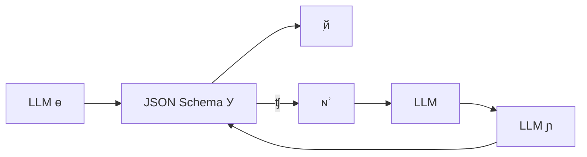
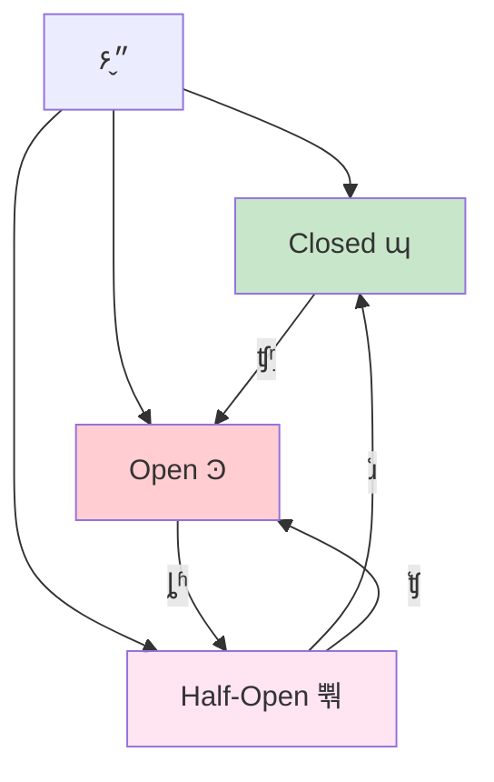
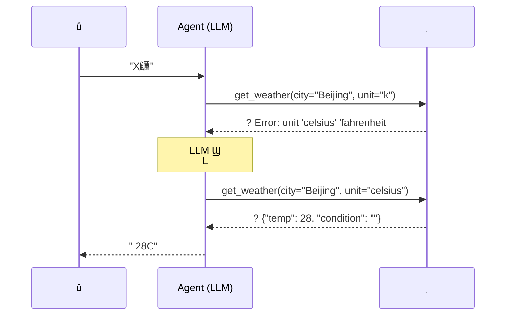
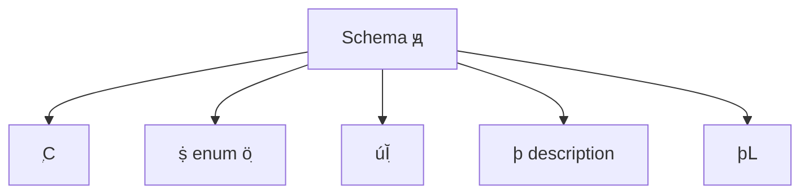
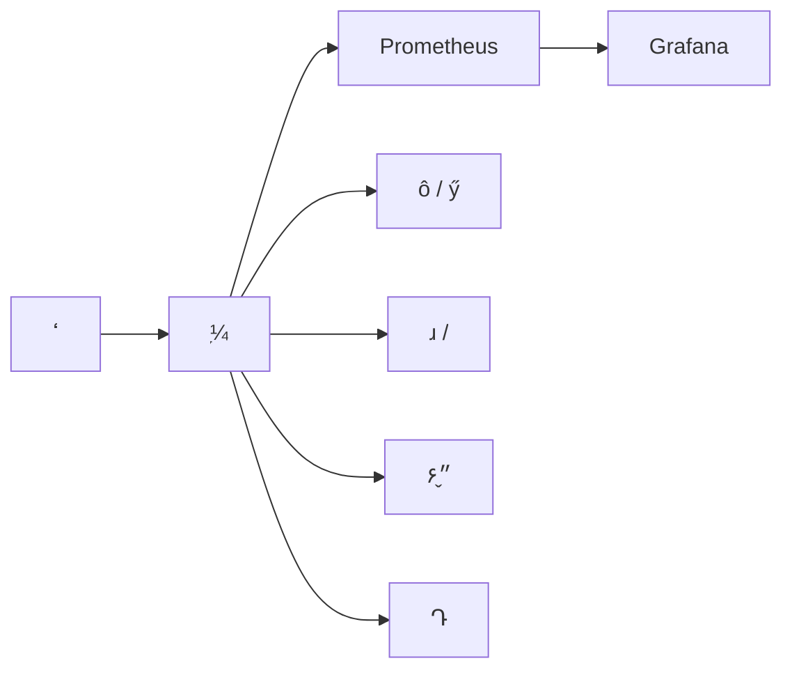

---
title: Agent ߵʧδ
description: ԲԵٵʱ۶ϣϵͳ Agent ߵõݴ
date: 2026-02-05T04:14:46+08:00
lastmod: 2026-02-05T04:14:46+08:00
weight: 2
tags:
  - 
  - Agent
  - ߵ
  - ݴ
categories:
  - 
  - 
math: true
mermaid: true
photos:
  - https://images.unsplash.com/photo-1551288049-bebda4e38f71?w=1920&q=80
---

## Գ

> **Թ**Ƶ AI Agent Ҫⲿߣݿѯʼȣû񡣵ʵУߵþʧܡʱDzʱ API ʱʱǵʣ Agent Ĺߵݴƣ LLM ֪ʧܺӦô

⿼ **AI ̵Ľ׳**Agent ͨ Chatbot ֻʴҪִʵIJκιߵöʧܡһûݴƵ AgentеĿԻdz͡

Թǣ㲻 LLM ߽磬ùֲֶЩ߽硪 Agent һоĹʦһ**󲻱ԡܽ**

## ߵõijʧ

ݴ֮ǰȶʧ࣬Ϊͬ͵ʧҪͬĴԡ

```mermaid
graph TD
    A[ߵʧ] --> B[]
    A --> C[糬ʱ]
    A --> D[API  429]
    A --> E[߲]
    A --> F[ҵ߼]

    B --> B1[LLM ɲϷ]
    B --> B2[ȱٱֶ]
    B --> B3[Ͳƥ]

    C --> C1[Ӧ]
    C --> C2[ж]

    D --> D1[̫]
    D --> D2[Ⱥľ]

    E --> E1[LLM þ칤]
    E --> E2[δע]

    F --> F1[޽]
    F --> F2[Ȩ޲]
    F --> F3[ݳͻ]
```

| ʧ | ʹϢ | Ƶ | س̶ |  |
|----------|-------------|----------|----------|--------|
|  | `TypeError: missing required field` |  |  |  |
| 糬ʱ | `TimeoutError` |  |  |  |
| API  | `429 Too Many Requests` |  |  | ǣ˱ܣ |
| ߲ | `KeyError: unknown function` |  |  | ѡȷߣ |
| ҵ߼ | `404 Not Found` / `403 Forbidden` |  |  |  |

**ؼ**͹ѡ LLM ⣬Ҫ LLM "֪"ʱǻʩ⣬ҪֶΣԡ۶ϣ

## 

### һУ Schema ֤

**Ԥʤ**ڵù֮ǰȶ LLM ɵIJϸУ飬ϷIJӦ÷ʵߡ



```python
import json
from jsonschema import validate, ValidationError
from typing import Any

# 幤ߵ JSON Schema
TOOL_SCHEMAS = {
    "search_web": {
        "type": "object",
        "properties": {
            "query": {"type": "string", "minLength": 1, "maxLength": 500},
            "num_results": {"type": "integer", "minimum": 1, "maximum": 20},
        },
        "required": ["query"],
        "additionalProperties": False,
    },
    "send_email": {
        "type": "object",
        "properties": {
            "to": {"type": "string", "format": "email"},
            "subject": {"type": "string", "maxLength": 200},
            "body": {"type": "string"},
        },
        "required": ["to", "subject", "body"],
        "additionalProperties": False,
    },
}


def validate_tool_args(tool_name: str, arguments: dict) -> tuple[bool, str]:
    """У鹤߲Ƿ Schema"""
    if tool_name not in TOOL_SCHEMAS:
        return False, f" '{tool_name}' ڡù: {list(TOOL_SCHEMAS.keys())}"
    try:
        validate(instance=arguments, schema=TOOL_SCHEMAS[tool_name])
        return True, "Уͨ"
    except ValidationError as e:
        return False, f"Уʧ: {e.message}·: {list(e.absolute_path)}"
```

### ָ˱ԣExponential Backoff

糬ʱ API **˲ʱ**ЧֶΡäĿԻط˸ʹ**ָ˱ + **ԡ

```mermaid
graph TD
    A[ù] --> B{ɹ?}
    B -->|| C[ؽ]
    B -->|| D{?}
    D -->|| E[ش]
    D -->|| F{Դ < ?}
    F -->|| E
    F -->|| G[ȴ backoff ʱ]
    G --> H[Լ]
    H --> A

    G --> G1["ȴ = base * 2^attempt + jitter"]
```

**ָ˱ܵѧģ**

$$t_n = \min(t_{\text{base}} \cdot 2^n + \text{jitter}, \ t_{\text{max}})$$

 $t_n$ ǵ $n$ ǰĵȴʱ䣬$t_{\text{base}}$ ǻӳ٣jitter ֹͻͬʱԵ"ȺЧӦ"

```python
import asyncio
import random
from functools import wraps
from typing import Callable, Type, Tuple

def retry_with_backoff(
    max_retries: int = 3,
    base_delay: float = 1.0,
    max_delay: float = 60.0,
    retryable_exceptions: Tuple[Type[Exception], ...] = (TimeoutError, ConnectionError),
):
    """ָ˱װ"""
    def decorator(func: Callable):
        @wraps(func)
        async def wrapper(*args, **kwargs):
            last_exception = None
            for attempt in range(max_retries + 1):
                try:
                    return await func(*args, **kwargs)
                except retryable_exceptions as e:
                    last_exception = e
                    if attempt == max_retries:
                        break
                    delay = min(base_delay * (2 ** attempt) + random.uniform(0, 1), max_delay)
                    print(f"  []  {attempt+1} ʧ: {e}{delay:.1f}s ...")
                    await asyncio.sleep(delay)
            raise last_exception
        return wrapper
    return decorator


# ʹʾ
@retry_with_backoff(max_retries=3, base_delay=1.0)
async def call_search_api(query: str) -> dict:
    """ APIʧԶ"""
    async with aiohttp.ClientSession() as session:
        async with session.post(
            "https://api.search.com/v1/search",
            json={"query": query},
            timeout=aiohttp.ClientTimeout(total=10),
        ) as resp:
            if resp.status == 429:
                raise ConnectionError("API Ҫ˱")
            resp.raise_for_status()
            return await resp.json()
```

### ʱ۶

ʱȴһѾҵķû塣ʱƺ۶ģʽֹܷɢ



```python
import time
from collections import deque
from dataclasses import dataclass, field

@dataclass
class CircuitBreaker:
    """򵥵۶ʵ"""
    failure_threshold: int = 5          # ʧֵܴ
    recovery_timeout: float = 30.0      # ۶Ϻָȴʱ䣨룩
    half_open_max_calls: int = 3        # 뿪״̬̽

    _state: str = "closed"              # closed / open / half_open
    _failure_count: int = 0
    _last_failure_time: float = 0.0
    _half_open_calls: int = 0

    @property
    def state(self) -> str:
        if self._state == "open":
            if time.time() - self._last_failure_time > self.recovery_timeout:
                self._state = "half_open"
                self._half_open_calls = 0
        return self._state

    def record_success(self):
        if self._state == "half_open":
            self._state = "closed"
        self._failure_count = 0

    def record_failure(self):
        self._failure_count += 1
        self._last_failure_time = time.time()
        if self._state == "half_open":
            self._state = "open"
        elif self._failure_count >= self.failure_threshold:
            self._state = "open"

    def can_execute(self) -> bool:
        state = self.state
        if state == "closed":
            return True
        if state == "half_open":
            if self._half_open_calls < self.half_open_max_calls:
                self._half_open_calls += 1
                return True
            return False
        return False  # open ״̬ܾ
```

### ģ

߳ײʱӦ Agent ʧܣӦбѡ

```mermaid
graph TD
    A[ߵ] --> B{ɹ?}
    B -->|| C[]
    B -->|| D[Ժľ]
    D --> E{бù?}
    E -->|| F[ñù]
    E -->|| G{л?}
    G -->|| H[ػ]
    G -->|| I[Ĭ/׻ظ]
    F --> C
    H --> C
    I --> J[֪û]
```

| 㼶 |  | ʾ |
|----------|------|------|
| һ |  | 綶µijʱ |
| ڶ | ù |  API ˣл |
|  |  | һγɹõĽ |
| IJ | Ĭϻظ | "Ǹùʱ" |

```python
# ʵ
class ToolExecutorWithFallback:
    """ԵĹִ"""

    def __init__(self):
        self.cache = {}          # 򵥻
        self.breakers = {}       # ÿһ۶

    async def execute_with_fallback(
        self,
        tool_name: str,
        arguments: dict,
        primary_func: Callable,
        fallback_func: Callable = None,
        default_response: str = None,
    ) -> dict:
        """ִйߣʧʱ㽵"""
        breaker = self.breakers.setdefault(tool_name, CircuitBreaker())

        # 㼶 0۶ʱֱ
        if not breaker.can_execute():
            return await self._fallback(arguments, fallback_func, default_response)

        try:
            result = await primary_func(**arguments)
            breaker.record_success()
            cache_key = f"{tool_name}:{hash(str(arguments))}"
            self.cache[cache_key] = result
            return {"status": "success", "data": result}

        except Exception as e:
            breaker.record_failure()
            return await self._fallback(arguments, fallback_func, default_response, str(e))

    async def _fallback(self, arguments, fallback_func, default_response, error=None):
        """"""
        # 㼶 2ù
        if fallback_func:
            try:
                result = await fallback_func(**arguments)
                return {"status": "degraded", "data": result, "source": "fallback"}
            except Exception:
                pass

        # 㼶 3
        cache_key = f"{hash(str(arguments))}"
        if cache_key in self.cache:
            return {"status": "degraded", "data": self.cache[cache_key], "source": "cache"}

        # 㼶 4Ĭϻظ
        return {"status": "failed", "data": default_response, "error": error}
```

### 壺 LLM 

 Agent ͨĹؼ**ߵʧʱϢ LLMԭѡ**



```python
# Agent ѭ
import json

MAX_CORRECTION_ROUNDS = 3  # ִ

async def agent_loop_with_self_correction(
    llm,
    user_message: str,
    tools: list[dict],
    tool_executor: ToolExecutorWithFallback,
):
    """ Agent ѭ"""

    messages = [
        {"role": "system", "content": "һܵùߵ֡߷شԭ"},
        {"role": "user", "content": user_message},
    ]

    for round_num in range(MAX_CORRECTION_ROUNDS + 5):
        # LLM 
        response = await llm.chat.completions.create(
            model="gpt-4o",
            messages=messages,
            tools=tools,
            tool_choice="auto",
        )
        msg = response.choices[0].message
        messages.append(msg)

        # ûйߵã˵ LLM ɻش
        if not msg.tool_calls:
            return msg.content

        # ִйߵ
        for tool_call in msg.tool_calls:
            func_name = tool_call.function.name
            try:
                arguments = json.loads(tool_call.function.arguments)
            except json.JSONDecodeError as e:
                # JSON ʧܣֱӷ
                messages.append({
                    "role": "tool",
                    "tool_call_id": tool_call.id,
                    "content": f"? JSON ʧ: {e}ȷغϷ JSON",
                })
                continue

            # У
            is_valid, error_msg = validate_tool_args(func_name, arguments)
            if not is_valid:
                messages.append({
                    "role": "tool",
                    "tool_call_id": tool_call.id,
                    "content": f"? Уʧ: {error_msg}ԡ",
                })
                continue

            # ִйߣݴ
            result = await tool_executor.execute_with_fallback(
                func_name, arguments,
                primary_func=TOOL_REGISTRY[func_name],
            )

            # 󣩷 LLM
            if result["status"] == "success":
                feedback = f"? ִгɹ: {json.dumps(result['data'], ensure_ascii=False)}"
            elif result["status"] == "degraded":
                feedback = f"?? ִ: {json.dumps(result['data'], ensure_ascii=False)}"
            else:
                feedback = f"? ִʧ: {result.get('error', 'δ֪')}볢޸IJ"

            messages.append({
                "role": "tool",
                "tool_call_id": tool_call.id,
                "content": feedback,
            })

    return "Ǹγ޷"
```

## ݴܴ

ΪһĹߵݴܣ

```python
"""
Agent ߵݴ
ܣSchema У  ָ˱  ʱ۶    LLM 
"""
import asyncio
import json
import random
import time
import aiohttp
from dataclasses import dataclass
from jsonschema import validate as jsonschema_validate, ValidationError as SchemaError
from typing import Callable, Any, Optional

# ============ 1. ۶ ============
@dataclass
class CircuitBreaker:
    failure_threshold: int = 5
    recovery_timeout: float = 30.0
    _state: str = "closed"
    _failures: int = 0
    _last_fail_time: float = 0.0

    def _check_state(self):
        if self._state == "open" and time.time() - self._last_fail_time > self.recovery_timeout:
            self._state, self._failures = "half_open", 0
        return self._state

    def allow(self) -> bool:
        return self._check_state() in ("closed", "half_open")

    def on_success(self):
        self._state, self._failures = "closed", 0

    def on_failure(self):
        self._failures += 1
        self._last_fail_time = time.time()
        if self._failures >= self.failure_threshold:
            self._state = "open"


# ============ 2. ݴĹִ ============
class RobustToolExecutor:
    def __init__(self):
        self.breakers: dict[str, CircuitBreaker] = {}
        self.cache: dict[str, Any] = {}

    async def call(
        self,
        name: str,
        args: dict,
        handler: Callable,
        schema: dict = None,
        max_retries: int = 3,
        timeout: float = 15.0,
        fallback: Callable = None,
    ) -> dict:
        # --- У ---
        if schema:
            try:
                jsonschema_validate(args, schema)
            except SchemaError as e:
                return {"ok": False, "error": f"Уʧ: {e.message}", "type": "schema"}

        breaker = self.breakers.setdefault(name, CircuitBreaker())

        # --- ۶ϼ ---
        if not breaker.allow():
            return {"ok": False, "error": "۶ݲ", "type": "circuit"}

        # --- Եִ ---
        for attempt in range(max_retries + 1):
            try:
                result = await asyncio.wait_for(handler(**args), timeout=timeout)
                breaker.on_success()
                self.cache[f"{name}:{args}"] = result
                return {"ok": True, "data": result}

            except asyncio.TimeoutError:
                breaker.on_failure()
                if attempt < max_retries:
                    delay = min(2 ** attempt + random.random(), 30)
                    await asyncio.sleep(delay)
                    continue
            except Exception as e:
                breaker.on_failure()
                if attempt < max_retries and not isinstance(e, (ValueError, KeyError)):
                    await asyncio.sleep(2 ** attempt)
                    continue

        # --- ù ---
        if fallback:
            try:
                data = await fallback(**args)
                return {"ok": True, "data": data, "source": "fallback"}
            except Exception:
                pass

        # ---  ---
        key = f"{name}:{args}"
        if key in self.cache:
            return {"ok": True, "data": self.cache[key], "source": "cache"}

        return {"ok": False, "error": "ԺͽԾʧ", "type": "exhausted"}


# ============ 3. ʾ ============
async def web_search(query: str, num: int = 5) -> list[dict]:
    """ģ"""
    await asyncio.sleep(0.5)
    if "error" in query:  # ģ
        raise ConnectionError("ʱ")
    return [{"title": f"{i}", "snippet": f" {query} ..."} for i in range(num)]

async def web_search_fallback(query: str, num: int = 5) -> list[dict]:
    """"""
    await asyncio.sleep(0.3)
    return [{"title": "ý", "snippet": f"ԱԴ {query} "}]


# ============ 4. ʾ ============
async def main():
    executor = RobustToolExecutor()

    search_schema = {
        "type": "object",
        "properties": {
            "query": {"type": "string", "minLength": 1},
            "num": {"type": "integer", "minimum": 1, "maximum": 20},
        },
        "required": ["query"],
    }

    # 
    result = await executor.call(
        "search", {"query": "Python ̳", "num": 3},
        handler=web_search, schema=search_schema, fallback=web_search_fallback,
    )
    print(f": {result}")

    # 󣨻ᱻ Schema أ
    result = await executor.call(
        "search", {"query": ""},
        handler=web_search, schema=search_schema,
    )
    print(f": {result}")

    # ģⳬʱ󽵼ù
    result = await executor.call(
        "search", {"query": "error", "num": 2},
        handler=web_search, schema=search_schema, fallback=web_search_fallback,
        max_retries=2,
    )
    print(f": {result}")

asyncio.run(main())
```

## ׷

### ׷һƹߵ JSON Schema

õ Schema ܴ LLM IJ



```json
{
  "name": "get_weather",
  "description": "ѯָеԤ֧δ 7 Ԥѯ",
  "parameters": {
    "type": "object",
    "properties": {
      "city": {
        "type": "string",
        "description": "ƣ֧ĺӢģ ''  'Beijing'"
      },
      "days": {
        "type": "integer",
        "description": "ѯδ1-7",
        "minimum": 1,
        "maximum": 7,
        "default": 1
      },
      "unit": {
        "type": "string",
        "enum": ["celsius", "fahrenheit"],
        "description": "¶ȵλ",
        "default": "celsius"
      }
    },
    "required": ["city"]
  }
}
```

> **ؼԭ**description ҪдLLM ǿ description ġöֵַĬֵIJҪΪ required

### ׷ʶLLM ѡô죿

LLM ܻþһڵĹڲҪùʱǿеã

1. **бԼ** tool_choice ֻṩ뵱ǰصĹӼٸ
2. **Ż** description ȷ˵"ʲôʱ""ʲôʱ򲻸"
3. **Few-shot ʾ** system prompt иȷѡ񹤾ߵʾ
4. **·ɲ㣨Router** Agent ѭһжûͼĸٴ LLM ӦĹ߼
5. **þ** LLM ˲ڵĹʱشϢиùбѡ

### ׷μعߵõĽ״

пɹ۲ԣ



ļָ꣺
- **ߵóɹ**άͳƣ 95% ĹҪŲ
- **P99 ӳ**ӳû飬ֵĹ߿Ǽӳʱ
- **۶**Ƶ˵ηȶ
- ****ζŻʩȶ
- ****Ƶ˵ҪŻ·

## С

Agent ߵõݴƣ**Ѵͳֲʽϵͳݴģʽԡ۶ϡ LLM е**

```mermaid
graph LR
    A[У<br/>Ԥ] --> B[/۶<br/>ʩ]
    B --> C[/<br/>ײ]
    C --> D[LLM <br/>ܲ]
    D --> E[ظ澯<br/>ά]

    style A fill:#e3f2fd
    style B fill:#e8f5e9
    style C fill:#f3e0
    style D fill:#f3e5f5
    style E fill:#fce4ec
```

лش⣬ǿ"**ֲ**"˼롪ÿһ㴦óĴָͣijһ⡣ͬʱLLM  Agent ڴͳ΢õ㣬ֵص
