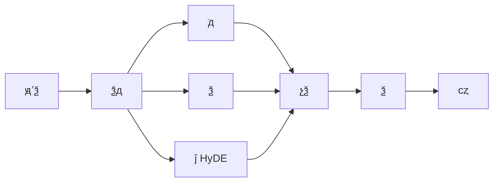

---
title: RAG ٻʵôŻ
description: ĵзֵϼٵϵͳ RAG ٻŻ
date: 2023-07-10T05:26:05+08:00
lastmod: 2023-07-10T05:26:05+08:00
weight: 1
tags:
  - 
  - RAG
  - ٻ
  - Ż
categories:
  - 
  - 
math: true
mermaid: true
photos:
  - https://images.unsplash.com/photo-1485846234645-a62644f84728?w=1920&q=80
---

## Գ

> **Թ** RAG ĿУû""Ƚ϶ࡣŲִģû⣬ڼ׶Ρص֪ʶûٻءʣRAG ٻʵͨЩԭЩάȥŻ

һ RAG ĸƵ⣬IJij֪ʶ㣬 **ǿȫ·** ϵͳ⡣һĻشӦôԤEmbeddingԡѯŻȶչֳʵս顣

ٻʣRecall RAG ϵͳߡȷ֪ʶƬûбǿģҲֻ"ɸΪ֮"ҵͳƣ** 70%  RAG Դڼ׶**ɽ׶Ρ

## ٻʵ͵ 5 󳣼ԭ

Ż֮ǰҪ׼ȷλ⡣ RAG ٻʵ 5 ԭ

### ԭһĵзֲ

```mermaid
graph LR
    A[ԭʼĵ] --> B{зֲ}
    B -->|̶з| C[ܽض]
    B -->|з| D[ܳȲ]
    B -->|ݹз| E[]
    C --> F[ؼϢж]
    D --> F
    E --> G[ٻϸ]
```

͵⣺̶ַзʱһĸӲг롣һ"ҩ A ĸðġͷʹ"""汻ضϣʱ۲ѯʲôƬζԱ׼ȷС

### ԭEmbedding ģƥ

ͨ Embedding ģͣ `text-embedding-ada-002`ڿֲڴֱҽơɡڴ룩ġһı"״"""룬ͨģͿ޷׼ȷ׽

### ԭ蹵

óƥ䣨"ô˿"  "˻"**ȷؼ**Ʒͺšţ紫ͳؼʼûʵƣٻʻԲ㡣

### ԭģѯĵڲ

ûʵԷ֪ʶĵдܴû"籣Ͻô"ĵд"ϱսɷжϺIJ"Ȼͬƶȿܲߡ

### ԭ壺Top-K Сδ

ֻȡ Top-5 ҲʱصĺѡУʵ޹صƬλἷõƬΡ

| ԭ | ͱ | Ӱ̶ |
|------|----------|----------|
| ĵзֲ | ؼϢضϡĶʧ |  |
| Embedding ƥ | רҵ޷ȷƥ |  |
|  | ȷؼѲ |  |
| ѯ-ĵ | ͬƶȵ |  |
| Top-K С/ | Ƭαѡ |  |

## Ż

### һĵзֲŻ

ĵз RAG ĵһֱӰлڵзֲ֣

```mermaid
graph TD
    A[ĵзֲ] --> B[̶з]
    A --> C[з]
    A --> D[ݹַз]

    B --> B1[ token/ַ]
    B --> B2[򵥵׽ض]

    C --> C1[//Ȼ߽]
    C --> C2[Ȳ]

    D --> D1[ȰָٰСָ]
    D --> D2[볤]
```

**1. ̶з֣Fixed-Size Chunking**

򵥵IJԣ̶ token з֣һصOverlap

```python
from langchain.text_splitter import RecursiveCharacterTextSplitter

# Ƽãchunk_size 500-10overlap Ϊ chunk_size  10%-20%
text_splitter = RecursiveCharacterTextSplitter(
    chunk_size=800,
    chunk_overlap=150,
    separators=["\n\n", "\n", "", "", "", "", " ", ""],
    length_function=len,
)
chunks = text_splitter.split_text(document_text)
```

**2. з֣Semantic Chunking**

ݾ֮ƶȶ̬зֵ㣬仯λþȻ߽磺

```python
from langchain_experimental.text_splitter import SemanticChunker
from langchain_openai import OpenAIEmbeddings

semantic_splitter = SemanticChunker(
    OpenAIEmbeddings(),
    breakpoint_threshold_type="percentile",  # ٷλֵ
    breakpoint_threshold_amount=95,           # ƶȲǰ 5% Ϊϵ
)
chunks = semantic_splitter.split_text(document_text)
```

**3. ṹз֣ Markdown / HTML**

ĵṹ㼶з֣IJ㼶Ϣ

```python
from langchain.text_splitter import MarkdownHeaderTextSplitter

headers_to_split_on = [
    ("#", "Header 1"),
    ("##", "Header 2"),
    ("###", "Header 3"),
]
md_splitter = MarkdownHeaderTextSplitter(headers_to_split_on)
md_chunks = md_splitter.split_text(markdown_text)
# ÿ chunk Դ metadata: {"Header 1": "...", "Header 2": "..."}
```

> **ʵս**ĵƼ chunk_size  500-800 ַoverlap Ϊ 100-200ڼĵʹ Markdown ṹз֣ڳݣʹõݹַз֡

### Embedding ģѡ

ѡʵ Embedding ģٻʵĹؼܸˡģͶԱȣ

| ģ | ά | ֧ | ʽ | ó |
|------|------|----------|----------|----------|
| `text-embedding-3-large` | 3072 |  | API | ͨӢ/ |
| `bge-large-zh-v1.5` | 1024 |  |  | Ĵֱ |
| `bge-m3` | 1024 |  |  | /ı |
| `gte-large-zh` | 1024 |  |  | ͨ |
| `jina-embeddings-v3` | 1024 |  | API |  |

```python
# ʹ BGE ģͣƼز𳡾
from FlagEmbedding import FlagModel

model = FlagModel('BAAI/bge-large-zh-v1.5',
                  query_instruction_for_retrieval="Ϊɱʾڼ£")
embeddings = model.encode_queries(["籣Ͻô"])
```

> ****Դֱ򣬿΢ Embedding ģͣԱѧϰЧ

### ϼ + ؼ BM25

ǽЧķ**ƥ䣩**  **ؼʼȷƥ䣩** ϣȡ̡

```mermaid
graph TD
    A[ûѯ] --> B[]
    A --> C[BMI25 ؼʼ]
    B --> D[ƶ]
    C --> E[ؼƥ]
    D --> F[ں RRF]
    E --> F
    F --> G[պѡ]
```

**BM25 ؼʼĺĹʽ**

$$\text{BM25}(D, Q) = \sum_{i=1}^{n} \text{IDF}(q_i) \cdot \frac{f(q_i, D) \cdot (k_1 + 1)}{f(q_i, D) + k_1 \cdot \left(1 - b + b \cdot \frac{|D|}{\text{avgdl}}\right)}$$

 $f(q_i, D)$ Ǵ $q_i$ ĵ $D$ еĴƵ$|D|$ ĵȣ$\text{avgdl}$ ƽĵȣ$k_1$  $b$ ǵڲ

**ںʹ RRFReciprocal Rank Fusion㷨**

$$\text{RRF}(d) = \sum_{r \in R} \frac{1}{k + r(d)}$$

 $r(d)$ ĵ $d$ ijһ·е$k$ ͨȡ 60

```python
from langchain.retrievers import BM25Retriever, EnsembleRetriever
from langchain.vectorstores import FAISS
from langchain_openai import OpenAIEmbeddings

# 1. 
vector_store = FAISS.from_documents(documents, OpenAIEmbeddings())
vector_retriever = vector_store.as_retriever(search_kwargs={"k": 20})

# 2. BM25 ؼʼ
bm25_retriever = BM25Retriever.from_documents(documents)
bm25_retriever.k = 20

# 3. ϼensemble
ensemble_retriever = EnsembleRetriever(
    retrievers=[vector_retriever, bm25_retriever],
    weights=[0.5, 0.5],  # ɸݳȨ
)

# 
results = ensemble_retriever.get_relevant_documents("籣Ͻô")
```

### ģѯдQuery Rewrite / Expansion

ûԭʼѯģֱӼЧѡͨ LLM Բѯидչٻʡ



**HyDEHypothetical Document Embeddings** һļɣ LLM ڲѯһ"Դĵ"ĵȥΪ"""ĵ"Էӽƶȸߡ

```python
from langchain.retrievers import ContextualCompressionRetriever, LLMChainExtractor

# ѯдûչΪزѯ
def rewrite_query(llm, original_query):
    prompt = f"""뽫ѯдΪ 3 ͬǶȵͬѯٻʡ

ԭʼѯ{original_query}

ʽÿһ
1. ...
2. ...
3. ...
"""
    response = llm.invoke(prompt)
    queries = [original_query]  # ԭʼѯ
    for line in response.content.strip().split("\n"):
        if line.strip() and line[0].isdigit():
            queries.append(line.split(".", 1)[1].strip())
    return queries

# HyDEɼĵڼ
from langchain.retrievers import HypotheticalDocumentRetriever

hyde_retriever = HypotheticalDocumentRetriever.from_llm(
    llm=llm,
    base_retriever=ensemble_retriever,
    custom_retriever_prompt=None,  # ʹĬ HyDE prompt
)
```

### 壺Cross-Encoder Rerank

Bi-Encoderٶȿ쵫ޣģͣCross-Encoderȸߵٶ߽ϣٻ Top-50 Cross-Encoder ŵ Top-5

```mermaid
graph LR
    A[ѯ] --> B[]
    B --> C[Top-50 ѡ]
    C --> D[Cross-Encoder ]
    D --> E[Top-5 Ž]
    E --> F[ LLM ]

    style B fill:#e8f5e9
    style D fill:#f3e0
```

| ģ | ܹ | ٶ |  | ; |
|----------|------|------|------|------|
| Bi-Encoder | ѯĵ |  |  | ɸٻ |
| Cross-Encoder | ѯĵƴӱ |  |  |  |

```python
from langchain.retrievers import ContextualCompressionRetriever
from langchain_cohere import CohereRerank

# ʹ Cohere RerankҲ bge-reranker ز
compressor = CohereRerank(top_n=5, model="rerank-multilingual-v3.0")

compression_retriever = ContextualCompressionRetriever(
    base_compressor=compressor,
    base_retriever=ensemble_retriever,  # ڻϼ
)

# ռ·ϼٻ 50  ȡ 5
final_results = compression_retriever.get_relevant_documents("ѯ")
```

**ز bge-rerankerƼ**

```python
from FlagEmbedding import FlagReranker

reranker = FlagReranker('BAAI/bge-reranker-v2-m3', use_fp16=True)
scores = reranker.compute_score([
    ['ѯı', 'ѡĵ1'],
    ['ѯı', 'ѡĵ2'],
])
```

## Ż˵˴ʾ

ϷΪһŻ·

```python
"""
RAG ٻŻϼ + 򷽰
pip install langchain langchain-openai faiss-cpu rank-bm25 FlagEmbedding
"""
from langchain_openai import OpenAIEmbeddings, ChatOpenAI
from langchain.vectorstores import FAISS
from langchain.retrievers import BM25Retriever, EnsembleRetriever
from langchain.text_splitter import RecursiveCharacterTextSplitter
from langchain.schema import Document
from FlagEmbedding import FlagReranker


class OptimizedRAGRetriever:
    """Ż RAG з  ϼ  """

    def __init__(self, documents: list[str]):
        self.llm = ChatOpenAI(model="gpt-4o", temperature=0)
        self.embeddings = OpenAIEmbeddings(model="text-embedding-3-large")
        self.reranker = FlagReranker('BAAI/bge-reranker-v2-m3', use_fp16=True)

        # Step 1: ݹз֣ص
        splitter = RecursiveCharacterTextSplitter(
            chunk_size=600,
            chunk_overlap=120,
            separators=["\n\n", "\n", "", "", "", "", " ", ""],
        )
        self.chunks = [
            Document(page_content=text, metadata={"source": f"doc_{i}"})
            for i, text in enumerate(splitter.split_text("\n\n".join(documents)))
        ]

        # Step 2:  + BM25 
        self.vector_store = FAISS.from_documents(self.chunks, self.embeddings)
        self.bm25_retriever = BM25Retriever.from_documents(self.chunks)
        self.bm25_retriever.k = 30

    def query_rewrite(self, question: str) -> list[str]:
        """ѯдɶѯ"""
        prompt = f"""²ѯдΪ3ͬﲻͬı壬ÿһҪš
ѯ{question}"""
        response = self.llm.invoke(prompt).content
        queries = [question] + [q.strip() for q in response.strip().split("\n") if q.strip()]
        return queries[:4]  #  4 ѯ

    def hybrid_retrieve(self, query: str, top_k: int = 30) -> list[Document]:
        """ϼ + BM25"""
        vector_retriever = self.vector_store.as_retriever(
            search_kwargs={"k": top_k}
        )
        ensemble = EnsembleRetriever(
            retrievers=[vector_retriever, self.bm25_retriever],
            weights=[0.6, 0.4],
        )
        return ensemble.get_relevant_documents(query)

    def rerank(self, query: str, candidates: list[Document], top_n: int = 5) -> list[Document]:
        """Cross-Encoder """
        pairs = [[query, doc.page_content] for doc in candidates]
        scores = self.reranker.compute_score(pairs)
        if isinstance(scores, float):
            scores = [scores]
        ranked = sorted(zip(candidates, scores), key=lambda x: x[1], reverse=True)
        return [doc for doc, _ in ranked[:top_n]]

    def retrieve(self, question: str, top_n: int = 5) -> list[Document]:
        """·д  ϼ  ȥ  """
        # 1. ѯд
        queries = self.query_rewrite(question)

        # 2. ѯϼ
        all_candidates = []
        seen = set()
        for q in queries:
            for doc in self.hybrid_retrieve(q):
                content_hash = hash(doc.page_content[:100])
                if content_hash not in seen:
                    seen.add(content_hash)
                    all_candidates.append(doc)

        # 3. ȡ Top-N
        return self.rerank(question, all_candidates, top_n)


# ʹʾ
if __name__ == "__main__":
    docs = ["...֪ʶĵ..."]
    retriever = OptimizedRAGRetriever(docs)
    results = retriever.retrieve("籣Ͻôɣ")
    for r in results:
        print(r.page_content[:80], r.metadata)
```

## Ч

Ż֮󣬱ֶ֤ЧǷRAG ĺָ꣺

| ָ | ʽ |  |
|------|------|------|
| **Recall@K** | $\frac{\text{еĵ}}{\text{ĵ}}$ | Top-K ٻ˶ٱĵ |
| **Precision@K** | $\frac{\text{еĵ}}{K}$ | Top-K жص |
| **MRR** | $\frac{1}{\|Q\|}\sum \frac{1}{\text{rank}_i}$ | һĵ |
| **NDCG@K** | $\frac{\text{DCG}}{\text{IDCG}}$ | λõĹһָ |
| **Hit Rate** | $\frac{\text{еIJѯ}}{\text{ܲѯ}}$ | ٻһĵIJѯ |

```python
# ʹ RAGAS 
from ragas import evaluate
from ragas.metrics import context_recall, context_precision
from datasets import Dataset

eval_data = Dataset.from_dict({
    "question": ["籣Ͻô죿", ...],
    "ground_truth": ["Ҫ...", ...],
    "contexts": [["ĵ1", "ĵ2"], ...],
})

results = evaluate(eval_data, metrics=[context_recall, context_precision])
print(f"Context Recall: {results['context_recall']:.4f}")
print(f"Context Precision: {results['context_precision']:.4f}")
```

> **ŻǰԱȾ**һҵ֪ʶĿУ"̶з + ""ݹз + ϼ + Rerank"Recall@5  0.62  0.89˵׼ȷʴ 68%  85%

## ׷

### ׷һٻʸߵȵô죿

ٻʸ˵ĵںѡУǰIJһõġŻ

1. **ǿ**ʹøǿ Cross-Encoder ģͣ LLM-as-a-Judge о
2. ** Top-K** Top-10  Top-3ֻ LLM ص
3. **Ĺ** LLM ٻĵιˣ޳޹
4. **Ȩ** BM25 ȨأԹؼƥ䣩Ȩ

### ׷ʶ·ٻκϲȥأ

·ٻأBM25֪ʶͼ׵ȣĺϲԣ

```mermaid
graph TD
    A[ѯ] --> B[]
    A --> C[BM25 ]
    A --> D[֪ʶͼ׼]
    B --> E[RRF ں]
    C --> E
    D --> E
    E --> F[ȥأݹϣ]
    F --> G[]
    G --> H[ Top-K]
```

- **RRFںϣ**ãԭʼֻ³ǿ
- **Ȩں**ҪȽͬķһMin-Max  Z-ScoreٰȨؼȨ
- **ȥز**ǰ N ַĹϣȥأƶֵƶ > 0.95 Ϊظ

### ׷ĵ飩δ

- **㼶Parent-Document**ȼСƬΣ׼λչڵĴƬΣṩģ
- **ժҪ**ÿ½ժҪȼժҪλ½ڣ½ϸ
- **༶з**ͬʱͬȵ chunk200/500/10ݲѯѡ

## С

RAG ٻŻһϵͳ̣û˼·**ؼ·𻷽Ų**

```mermaid
graph LR
    A[ĵз] --> B[Embedding ģ]
    B --> C[ϼ]
    C --> D[ѯд]
    D --> E[]
    E --> F[]

    style A fill:#e3f2fd
    style C fill:#e8f5e9
    style E fill:#f3e0
    style F fill:#fce4ec
```

лش⣬鰴"**λ  ֲŻ  **"߼չչʾϵͳ˼ά͹̾顣סõŻԶ**ĵ**äĿѵ
