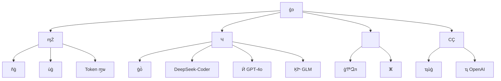
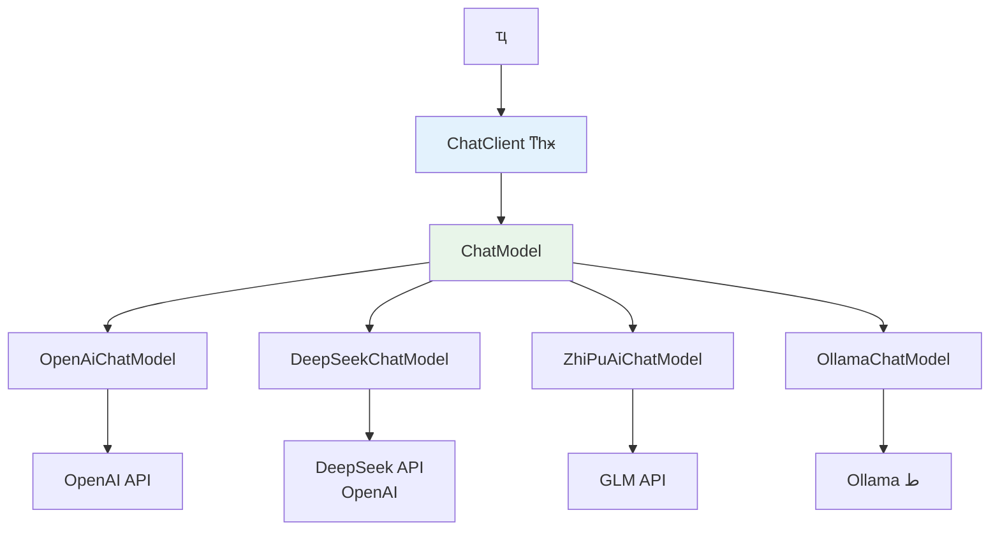
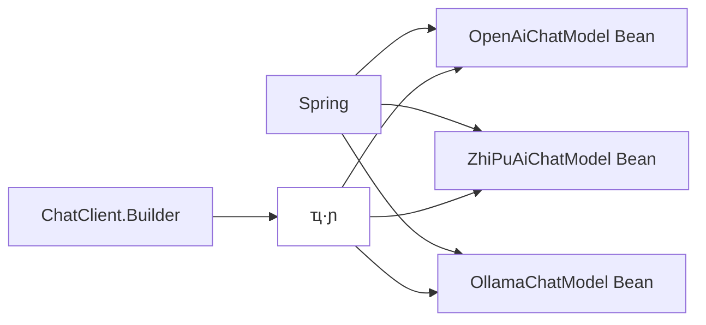
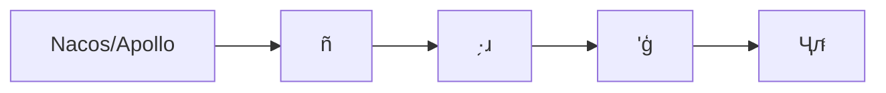
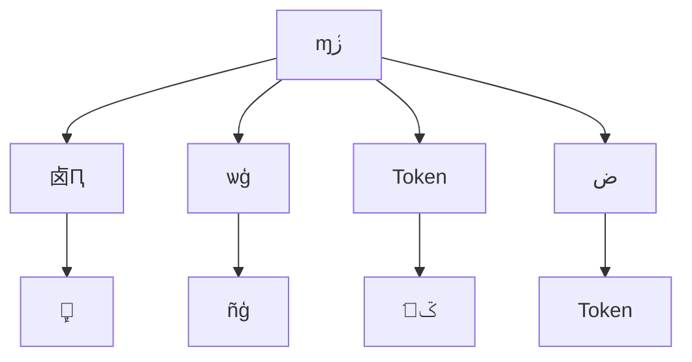

---
title: SpringAI νģͣOpenAIDeepSeekGLM
description: ͨͳһ OpenAIDeepSeekGLM ȶģͣʵģͿɲл
date: 2023-10-13T20:20:32+08:00
lastmod: 2023-10-13T20:20:32+08:00
weight: 4
tags:
  - 
  - SpringAI
  - ģ
  - ˹
categories:
  - 
  - 
math: true
mermaid: true
photos:
  - https://images.unsplash.com/photo-1542831371-29b0f74f9713?w=1920&q=80
---

## Գ

> **Թ**ǵҵҪõִģ͡ DeepSeek ɱ GPT-4o Чij GLMǺ Java ջû˽ SpringAIһ Spring Boot Ŀͬʱ OpenAIDeepSeekGLM ģܸͣͶ̬л

⿼ ** AI ̻**ҵӦУ"ģ͹"һƲĻ⣺ͬģ͸ӣɱЧӳ١ϹҪͬҵҪϡSpringAI Ϊ Spring ٷ AI ɿܣṩһŵijЩ⡣

Թǣ㲻 SpringAI  API **ģͳ**** Bean ע****·ɲ** Ⱥ˹̺ĸ

## ΪʲôҪģ

### ģ͵ҵ



### ͬģͶԱ

| ģ | ṩ |  | ۸ | ó |
|------|--------|------|----------|----------|
| GPT-4o | OpenAI | ۺǿ | $2.5/M tokens | Ӣij |
| DeepSeek-V3 | DeepSeek | Լ۱ȼߣǿ | 1/M tokens | ɡճԻ |
| GLM-4 |  AI | 㣬ںϹ | 5/M tokens | ijҵ |
| Claude 3.5 | Anthropic | ıȫԺ | $3/M tokens | ĵϹ泡 |

> **ɱԱʵ** 100  Token GPT-4o Լ 18DeepSeek-V3 Լ 1GLM-4 Լ 5ڸ߲ҵϵͳѡģͿԽʡ 80% ϵ API ɱ

## SpringAI ܹ

### ij

SpringAI ѧ **"һ APIģ"**ͨͳһijβͬģṩ̵IJ죺



### ؼ

|  |  | ˵ |
|------|------|------|
| `ChatClient` | ͳһ | ʽ API RestClient |
| `ChatModel` | ģͳӿ | ײģͽӿڣÿṩһʵ |
| `ChatLanguageModel` | ͬģͽӿ | Ի |
| `StreamingChatLanguageModel` | ʽģͽӿ | ֧ SSE ʽ |
| `EmbeddingModel` | ģͽӿ | ı |
| `AutoConfiguration` | Զ | ÿṩһ starter |

### ģ Bean ע

SpringAI ͨ Spring װƣΪÿṩ̴ `ChatModel` BeanҪͬʱʹöģʱؼ **ֺ͹Щ Bean**



## ʵ٣ģ

### Ŀ

```xml
<!-- pom.xml -->
<dependencies>
    <!-- Spring Boot Starter -->
    <dependency>
        <groupId>org.springframework.boot</groupId>
        <artifactId>spring-boot-starter-web</artifactId>
    </dependency>

    <!-- SpringAI BOM -->
    <dependencyManagement>
        <dependencies>
            <dependency>
                <groupId>org.springframework.ai</groupId>
                <artifactId>spring-ai-bom</artifactId>
                <version>1.0.0</version>
                <type>pom</type>
                <scope>import</scope>
            </dependency>
        </dependencies>
    </dependencyManagement>

    <!-- SpringAI OpenAIDeepSeek ҲôΪ OpenAI ӿڣ -->
    <dependency>
        <groupId>org.springframework.ai</groupId>
        <artifactId>spring-ai-openai-spring-boot-starter</artifactId>
    </dependency>

    <!-- SpringAI  GLM -->
    <dependency>
        <groupId>org.springframework.ai</groupId>
        <artifactId>spring-ai-zhipuai-spring-boot-starter</artifactId>
    </dependency>
</dependencies>
```

### ģ

```yaml
# application.yml
spring:
  ai:
    # OpenAI ãGPT-4o
    openai:
      api-key: ${OPENAI_API_KEY}
      base-url: https://api.openai.com
      chat:
        options:
          model: gpt-4o
          temperature: 0.7
          max-tokens: 4096

    #  GLM 
    zhi-pu-ai:
      api-key: ${ZHIPU_API_KEY}
      chat:
        options:
          model: glm-4-plus
          temperature: 0.7
          max-tokens: 4096

# ԶģãDeepSeek ͨ OpenAI ݽӿڣ
multi-model:
  deepseek:
    api-key: ${DEEPSEEK_API_KEY}
    base-url: https://api.deepseek.com
    model: deepseek-chat
    temperature: 0.7
  routing:
    # Ĭģ
    default: deepseek
    # ·
    task-routing:
      complex-reasoning: openai
      code-generation: deepseek
      chinese-nlp: glm
      general: deepseek
```

### ࣺģ Bean

```java
package com.example.ai.config;

import org.springframework.ai.openai.OpenAiChatModel;
import org.springframework.ai.openai.OpenAiChatOptions;
import org.springframework.ai.openai.api.OpenAiApi;
import org.springframework.ai.zhipuai.ZhiPuAiChatModel;
import org.springframework.ai.zhipuai.api.ZhiPuAiApi;
import org.springframework.beans.factory.annotation.Qualifier;
import org.springframework.beans.factory.annotation.Value;
import org.springframework.context.annotation.Bean;
import org.springframework.context.annotation.Configuration;
import org.springframework.web.client.RestClient;

/**
 * ģ
 * Ϊÿģṩ̴ ChatModel Bean
 */
@Configuration
public class MultiModelConfig {

    // ========== OpenAI (GPT-4o) ==========
    @Bean
    @Qualifier("openaiChatModel")
    public OpenAiChatModel openaiChatModel(
            @Value("${spring.ai.openai.api-key}") String apiKey,
            @Value("${spring.ai.openai.base-url}") String baseUrl) {
        OpenAiApi openAiApi = OpenAiApi.builder()
                .baseUrl(baseUrl)
                .apiKey(apiKey)
                .restClientBuilder(RestClient.builder())
                .build();
        return OpenAiChatModel.builder()
                .openAiApi(openAiApi)
                .defaultOptions(OpenAiChatOptions.builder()
                        .model("gpt-4o")
                        .temperature(0.7)
                        .maxTokens(4096)
                        .build())
                .build();
    }

    // ========== DeepSeek (ͨ OpenAI ݽӿ) ==========
    @Bean
    @Qualifier("deepseekChatModel")
    public OpenAiChatModel deepseekChatModel(
            @Value("${multi-model.deepseek.api-key}") String apiKey,
            @Value("${multi-model.deepseek.base-url}") String baseUrl) {
        OpenAiApi deepSeekApi = OpenAiApi.builder()
                .baseUrl(baseUrl)   // DeepSeek  OpenAI ݶ˵
                .apiKey(apiKey)
                .restClientBuilder(RestClient.builder())
                .build();
        return OpenAiChatModel.builder()
                .openAiApi(deepSeekApi)
                .defaultOptions(OpenAiChatOptions.builder()
                        .model("deepseek-chat")
                        .temperature(0.7)
                        .maxTokens(4096)
                        .build())
                .build();
    }

    // ========== GLM () ==========
    @Bean
    @Qualifier("glmChatModel")
    public ZhiPuAiChatModel glmChatModel(
            @Value("${spring.ai.zhi-pu-ai.api-key}") String apiKey) {
        ZhiPuAiApi zhiPuAiApi = new ZhiPuAiApi(apiKey);
        return new ZhiPuAiChatModel(zhiPuAiApi);
    }
}
```

### ģ·ɲ

```java
package com.example.ai.routing;

import org.springframework.ai.chat.model.ChatModel;
import org.springframework.beans.factory.annotation.Qualifier;
import org.springframework.stereotype.Component;

import java.util.Map;

/**
 * ģ·ѡʵģ
 */
@Component
public class ModelRouter {

    private final Map<String, ChatModel> chatModels;
    private final Map<String, String> taskRouting;

    public ModelRouter(
            @Qualifier("openaiChatModel") ChatModel openaiModel,
            @Qualifier("deepseekChatModel") ChatModel deepseekModel,
            @Qualifier("glmChatModel") ChatModel glmModel) {
        this.chatModels = Map.of(
                "openai", openaiModel,
                "deepseek", deepseekModel,
                "glm", glmModel
        );
        //   ģӳ
        this.taskRouting = Map.of(
                "complex-reasoning", "openai",
                "code-generation", "deepseek",
                "chinese-nlp", "glm",
                "general", "deepseek"
        );
    }

    /**
     * ѡģ
     */
    public ChatModel routeByTask(String taskType) {
        String modelKey = taskRouting.getOrDefault(taskType, "deepseek");
        return chatModels.get(modelKey);
    }

    /**
     * Զж
     */
    public ChatModel routeByContent(String userInput) {
        String taskType = classifyTask(userInput);
        return routeByTask(taskType);
    }

    /**
     * ࣨʵп LLM ͼʶ
     */
    private String classifyTask(String input) {
        String lower = input.toLowerCase();
        if (input.matches(".*[\\{\\}].*|.*def .*|.*public class.*|.*function.*")) {
            return "code-generation";
        }
        if (lower.contains("") || lower.contains("֤") || lower.contains("")) {
            return "complex-reasoning";
        }
        if (input.chars().filter(c -> c > 127).count() > input.length() * 0.5) {
            return "chinese-nlp";
        }
        return "general";
    }

    /**
     * ָģ
     */
    public ChatModel getModel(String modelName) {
        return chatModels.getOrDefault(modelName, chatModels.get("deepseek"));
    }
}
```

### ͳһ

```java
package com.example.ai.service;

import org.springframework.ai.chat.messages.UserMessage;
import org.springframework.ai.chat.model.ChatModel;
import org.springframework.ai.chat.prompt.Prompt;
import org.springframework.stereotype.Service;
import reactor.core.publisher.Flux;

@Service
public class MultiModelChatService {

    private final ModelRouter modelRouter;

    public MultiModelChatService(ModelRouter modelRouter) {
        this.modelRouter = modelRouter;
    }

    /**
     * ·ɶԻ
     */
    public String chat(String userInput, String taskType) {
        ChatModel model = modelRouter.routeByTask(taskType);
        Prompt prompt = new Prompt(new UserMessage(userInput));
        return model.call(prompt).getResult().getOutput().getText();
    }

    /**
     * Զʶ
     */
    public String chatAuto(String userInput) {
        ChatModel model = modelRouter.routeByContent(userInput);
        Prompt prompt = new Prompt(new UserMessage(userInput));
        return model.call(prompt).getResult().getOutput().getText();
    }

    /**
     * ָģͶԻ
     */
    public String chatWithModel(String userInput, String modelName) {
        ChatModel model = modelRouter.getModel(modelName);
        Prompt prompt = new Prompt(new UserMessage(userInput));
        return model.call(prompt).getResult().getOutput().getText();
    }

    /**
     * ʽ
     */
    public Flux<String> streamChat(String userInput, String taskType) {
        ChatModel model = modelRouter.routeByTask(taskType);
        Prompt prompt = new Prompt(new UserMessage(userInput));
        return model.stream(prompt)
                .map(response -> response.getResult().getOutput().getText());
    }

    /**
     * ģͽģʧʱԶлģ
     */
    public String chatWithFallback(String userInput, String primaryModel) {
        String[] fallbackChain = switch (primaryModel) {
            case "openai" -> new String[]{"openai", "glm", "deepseek"};
            case "glm" -> new String[]{"glm", "deepseek", "openai"};
            default -> new String[]{"deepseek", "glm", "openai"};
        };

        for (String modelName : fallbackChain) {
            try {
                return chatWithModel(userInput, modelName);
            } catch (Exception e) {
                System.err.println("ģ " + modelName + " ʧ: " + e.getMessage());
            }
        }
        return "Ǹģ;ãԺԡ";
    }
}
```

### Controller 

```java
package com.example.ai.controller;

import org.springframework.web.bind.annotation.*;
import reactor.core.publisher.Flux;

@RestController
@RequestMapping("/api/chat")
public class ChatController {

    private final MultiModelChatService chatService;

    public ChatController(MultiModelChatService chatService) {
        this.chatService = chatService;
    }

    /** ͶԻ */
    @PostMapping("/task")
    public String chatByTask(@RequestParam String message,
                              @RequestParam(defaultValue = "general") String taskType) {
        return chatService.chat(message, taskType);
    }

    /** Զ·ɶԻ */
    @PostMapping("/auto")
    public String chatAuto(@RequestParam String message) {
        return chatService.chatAuto(message);
    }

    /** ָģͶԻ */
    @PostMapping("/model/{modelName}")
    public String chatWithModel(@PathVariable String modelName,
                                 @RequestParam String message) {
        return chatService.chatWithModel(message, modelName);
    }

    /** ʽSSE */
    @GetMapping(value = "/stream", produces = "text/event-stream")
    public Flux<String> streamChat(@RequestParam String message,
                                    @RequestParam(defaultValue = "general") String taskType) {
        return chatService.streamChat(message, taskType);
    }

    /** ĶԻ */
    @PostMapping("/resilient")
    public String chatResilient(@RequestParam String message,
                                 @RequestParam(defaultValue = "deepseek") String primaryModel) {
        return chatService.chatWithFallback(message, primaryModel);
    }
}
```

## ܹͼ

```mermaid
graph TD
    A[ͻ] --> B[ChatController]
    B --> C[MultiModelChatService]
    C --> D[ModelRouter ·]

    D --> E{}
    E -->|complex-reasoning| F[OpenAI GPT-4o]
    E -->|code-generation| G[DeepSeek-V3]
    E -->|chinese-nlp| H[GLM-4-Plus]
    E -->|general| G

    C --> I[·]
    I --> J{ģͿ?}
    J -->|| K[ģͽ]
    J -->|| L[лģ]
    L --> M[GLM / DeepSeek / OpenAI]

    style D fill:#f3e0
    style I fill:#fce4ec
```

## ׷

### ׷һʵģͶ̬л

ϷͨЧáУҪ**лģ**



```java
/**
 * ̬·ã Nacos ģ
 */
@Component
@RefreshScope  // Spring Cloud Զˢ
public class DynamicModelRouter {

    private Map<String, String> routingRules;

    @Value("#{${multi-model.routing.task-routing}}")
    public void setRoutingRules(Map<String, String> rules) {
        this.routingRules = rules;
        // ñʱԶ
    }

    /**
     * ֶ̨лĬģ
     */
    @PostMapping("/admin/switch-model")
    public String switchDefaultModel(@RequestParam String modelName) {
        // дģнڵԶЧ
        configService.publishConfig("multi-model.routing.default", modelName);
        return "лɹĬģ: " + modelName;
    }
}
```

### ׷ʶģ A/B ԣ

```mermaid
graph TD
    A[û] --> B[]
    B -->|80%| C[A 飺DeepSeek]
    B -->|20%| D[B 飺GPT-4o]
    C --> E[¼ָ꣺ӳ//ɱ]
    D --> E
    E --> F[ͳƷ]
    F --> G{?}
    G -->|| H[ȫлģ]
    G -->|| I[]
```

```java
/**
 * A/B 
 */
@Component
public class ABTestRouter {

    private final Map<String, ChatModel> models;
    private final MetricsCollector metrics;

    public String chatWithABTest(String userInput, String experimentName) {
        // û ID ȷԷͰ
        String bucket = assignBucket(userInput, experimentName);

        String modelName = switch (bucket) {
            case "control" -> "deepseek";
            case "experiment" -> "openai";
            default -> "deepseek";
        };

        long start = System.currentTimeMillis();
        String result = models.get(modelName)
                .call(new Prompt(new UserMessage(userInput)))
                .getResult().getOutput().getText();
        long latency = System.currentTimeMillis() - start;

        // ¼ָں
        metrics.record(experimentName, modelName, latency, result.length());

        return result;
    }

    private String assignBucket(String userId, String experiment) {
        int hash = Math.abs(userId.hashCode()) % 100;
        if (hash < 80) return "control";       // 80% 
        return "experiment";                     // 20% ʵ
    }
}
```

### ׷ģ͵ijɱιܿأ



```java
/**
 * ɱܿ
 */
@Component
public class CostGuardInterceptor {

    private final TokenCounter tokenCounter;
    private final Map<String, BigDecimal> modelPricing;  // ÿģ͵

    public CostGuardInterceptor() {
        this.modelPricing = Map.of(
                "openai", new BigDecimal("0.018"),    // /1K tokens
                "deepseek", new BigDecimal("0.001"),
                "glm", new BigDecimal("0.005")
        );
    }

    public String chatWithCostControl(String userId, String input,
                                       String taskType, BigDecimal budget) {
        // Ԥ Token 
        int estimatedTokens = tokenCounter.estimate(input) + 500;

        // ԤѡģͣԤѡ˵ģԤѡõ
        String selectedModel = selectModelByBudget(estimatedTokens, budget);

        // ִ
        return chatService.chatWithModel(input, selectedModel);
    }

    private String selectModelByBudget(int tokens, BigDecimal budget) {
        // ÿģ͵ĻѣѡԤЧõ
        for (String model : new String[]{"openai", "glm", "deepseek"}) {
            BigDecimal cost = modelPricing.get(model)
                    .multiply(BigDecimal.valueOf(tokens / 10.0));
            if (cost.compareTo(budget) <= 0) {
                return model;
            }
        }
        return "deepseek"; // ˵Ķ
    }
}
```

## С

SpringAI ģ͵ĺ˼· **ͳһ + ·ɲ**

```mermaid
graph LR
    A[ChatClient ͳһ] --> B[ ChatModel Bean]
    B --> C[ModelRouter ·ɲ]
    C --> D[/ɱ/ѡģ]
    D --> E[/AB/ɱܿ]

    style A fill:#e3f2fd
    style C fill:#f3e0
    style D fill:#e8f5e9
    style E fill:#fce4ec
```

| Ҫ | ؼ | ֵ |
|----------|----------|------|
| ͳһ | `ChatModel` ӿ | ҵģͽ |
|  Bean  | `@Qualifier`  | ͬʱעģ |
| · |  + ·ɱ | Զѡģ |
| ֽ | Fallback  | ģ͹Զл |
| ɱܿ | Ԥ֪ѡ | ԤѡЧ |
| ̬л |  + `@RefreshScope` | ͣģ |

лش⣬"**ΪʲôҪģ  SpringAI ܹ  ʵ  ·뽵  ̬л AB **"ݽչʾ㲻д CRUDƳ߱ **չԡάԡɱʶ** ҵ AI ˼ܹ
