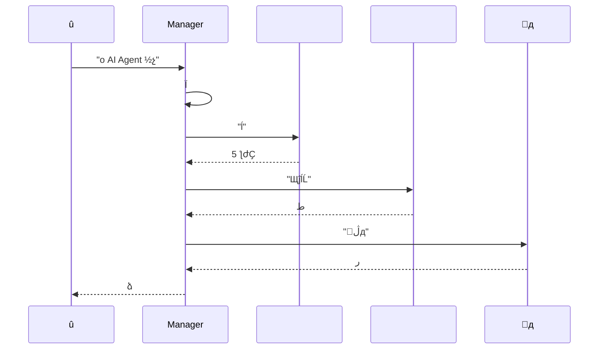
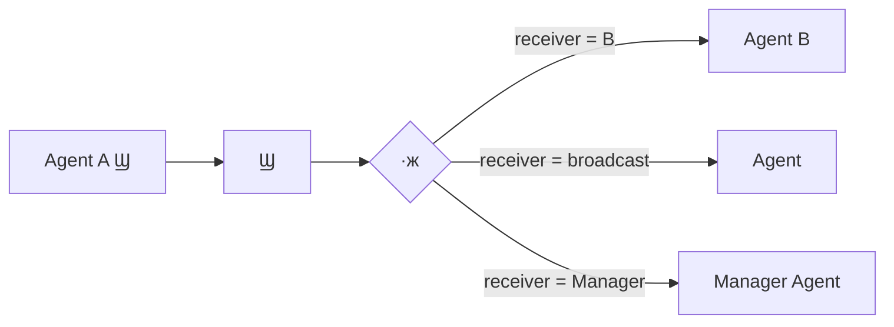
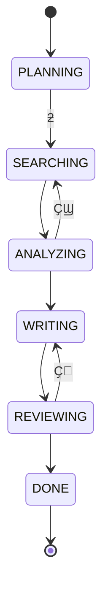
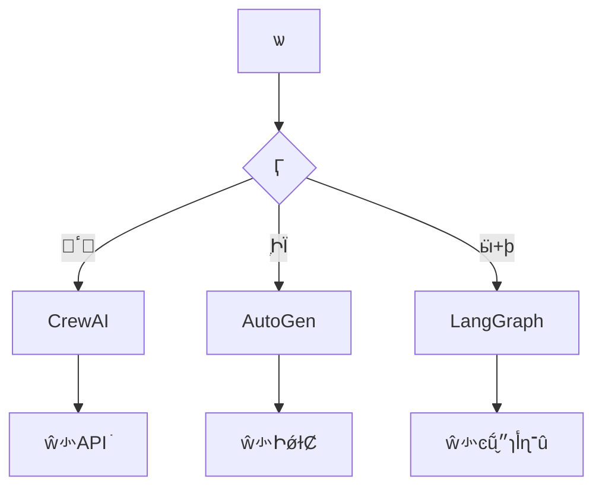
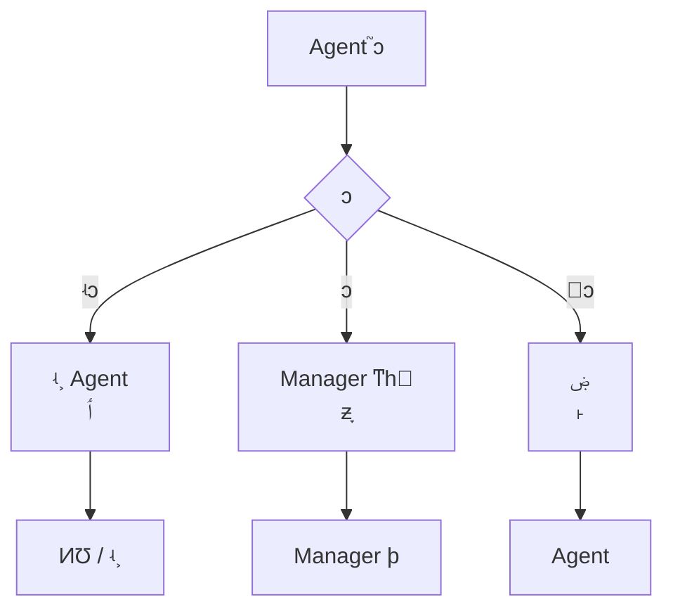

---
title:  Agent ϵͳƣ
description: ӽɫƵͨЭٵ״̬ϵͳն Agent ЭϵͳƷ
date: 2024-05-17T09:38:18+08:00
lastmod: 2024-05-17T09:38:18+08:00
weight: 7
tags:
  - 
  - Agent
  - ϵͳ
  - Э
categories:
  - 
  - 
math: true
mermaid: true
photos:
  - https://images.unsplash.com/photo-1504384308090-c894fdcc538d?w=1920&q=80
---

## Գ

> **Թ**Ҫһ"AI о"ϵͳԶסݡ׫д档õ Agent Ƕ Agentö AgentôƽɫЭ̣
>
> **ѡ**ָ Agent áһɶɫ滮߸߸߸ݴ׫д߸档 Manager-Worker ˣ滮ߵ Manager Э Worker
>
> **Թ**Agent ֮ôͨţߺ׫д߶Խзô죿Token ɱôƣ

һ **ϵͳ + Agent ** ĸ߽⡣ Agent ϵͳǵǰ AI Ӧõǰط漰ɫơͨЭ顢״̬ͻȶάȡĽϵͳƷۡ

## ΪʲôҪ Agent

###  Agent 

Ӷʱһ Agent ᵼ⣺

```mermaid
graph TD
    A[" Agent ľ"] --> B["ɫ"]
    A --> C[""]
    A --> D["߽ģ"]

    B --> B1["System Prompt ͻ<br/>Ҫ滮Ҫִ"]
    C --> C1["йһ<br/>Token ļ"]
    D --> D1["ʲôһ<br/>ʲô"]

    B1 --> E["ְ"]
    C1 --> E
    D1 --> E
    E --> F[" Agent Эϵͳ"]
```

|  |  Agent ı |  Agent  |
|------|---------------|----------------|
| **ɫ** | һ Prompt Ҫ滮ҪִУͻ | ÿɫ Prompt ۽һְ |
| **** | йߡʷԻһ | ɫģ |
| **߽** | ʲôʲô | רҵֹ۽ |
| **ά** | ޸һӰȫ | ޸ĵɫӰ |
| **չ** |  Prompt  | ɫ |

### ʲôʱö Agent

гҪ Agentݣ

| Ӷ | Ƽ | ʾ |
|-----------|---------|------|
| 򵥣1-2  |  Agent | "λ" |
| еȣ3-5  |  Agent + ߵ | "ձ" |
| ӣಽ裬 | ** Agent** | "огƲ׫д" |
| ӣҪ/֤ | ** Agent + ** | "һͶʾߵķ" |

## άһɫ

### SRP ԭ

е**һְԭSingle Responsibility Principle**  Agent ƣÿɫӦֻһԭ

һĽɫĸҪأ

| Ҫ |  | ʾߣ |
|------|------|--------------|
| **ݣIdentity** | ɫ˭óʲô | "һѧר" |
| **Capability** | ܵЩ | `web_search``paper_download` |
| **ԼConstraint** | Ϊ߽ | "ֻؽ 3 " |
| **Ŀ꣨Goal** | ǰIJ | "ҵ 5 ƪIJȡؼϢ" |

```python
from dataclasses import dataclass, field
from typing import Any

@dataclass
class RoleDefinition:
    """ɫ壺ݡԼĿ"""
    name: str                          # ɫ
    identity: str                      # 
    capabilities: list[str]            # ùб
    constraints: list[str]             # ΪԼ
    goal: str = ""                     # ɫĿ

    def build_prompt(self) -> str:
        """ҪԶ System Prompt"""
        caps = "\n".join(f"  - {c}" for c in self.capabilities)
        cons = "\n".join(f"  - {c}" for c in self.constraints)
        return f"""ǡ{self.name}
ݣ{self.identity}

{caps}
ΪԼ
{cons}
ǰĿ꣺{self.goal}"""
```

### ɫź

ʲôʱӦòֽɫźųʱ˵ǰɫе˹ְ

- System Prompt  500 Token Ұ"ͬʱ"Ӵ
- һɫҪó 5 
- ֮ͬгͻ"д""ϸʵ˲"

## άȶЭ

### ˽ṹ

```mermaid
graph TB
    subgraph "1. Manager-Worker"
        M1[Manager] --> W1[]
        M1 --> W2[]
        M1 --> W3[׫д]
    end

    subgraph "2. "
        D1[ Agent] <--> D2[ Agent]
        D1 <--> D3[]
        D2 <--> D3
    end

    subgraph "3. ˮ"
        P1[] --> P2[]
        P2 --> P3[׫д]
        P3 --> P4[У]
    end

    subgraph "4. רЭ"
        E1[ר A] --> BB[ڰ/ռ]
        E2[ר B] --> BB
        E3[ר C] --> BB
    end
```

˵ϸԱȣ

| ˽ṹ | Ʒʽ | ŵ | ȱ | ó |
|---------|---------|------|------|---------|
| **Manager-Worker** | Ļ | ṹʵ | Manager ƿ | ɷֽij |
| **** | ȥĻ | ۸Ͻ | Token Ĵ | Ҫ֤ľ߳ |
| **ˮ** | ˳ת | Ч׶β׼ | Ե | ̶̹ij |
| **רЭ** | ڰ | רҿɲ | Э | ʽ̽ |

### Manager-Worker ʵ

õˣһ Manager Agent 滮ͷ䣬 Worker Agent ִУ



## άͨЭ

### ṹϢ

Agent ֮ͨŲıнṹϢʽշ޷ɿ

```python
from enum import Enum
from dataclasses import dataclass, field
from datetime import datetime
from typing import Any

class MessageType(Enum):
    """Ϣö"""
    TASK_ASSIGN = "task_assign"      # 
    RESULT_REPORT = "result_report"  # 㱨
    QUESTION = "question"            # 
    FEEDBACK = "feedback"            # 
    HANDOFF = "handoff"              # ƽ

@dataclass
class AgentMessage:
    """ṹ Agent Ϣ"""
    sender: str                        # ߽ɫ
    receiver: str                      # ߽ɫ
    msg_type: MessageType              # Ϣ
    content: str                       # Ϣ
    context: dict[str, Any] = field(default_factory=dict)  # 
    timestamp: str = field(default_factory=lambda: datetime.now().isoformat())

    def to_dict(self) -> dict:
        return {
            "sender": self.sender,
            "receiver": self.receiver,
            "msg_type": self.msg_type.value,
            "content": self.content,
            "context": self.context,
            "timestamp": self.timestamp,
        }
```

### Ϣ·



## άģ״̬

### ״̬ģʽFSM

̶̹Ķ Agent ϵͳ״̬FSMɿ״̬ʽ



```python
from enum import Enum, auto

class WorkflowState(Enum):
    """״̬ö"""
    PLANNING = auto()
    SEARCHING = auto()
    ANALYZING = auto()
    WRITING = auto()
    REVIEWING = auto()
    DONE = auto()

class WorkflowStateMachine:
    """״̬ Agent """

    # Ϸ״̬ת
    TRANSITIONS = {
        WorkflowState.PLANNING: {WorkflowState.SEARCHING},
        WorkflowState.SEARCHING: {WorkflowState.ANALYZING},
        WorkflowState.ANALYZING: {
            WorkflowState.SEARCHING,  # Ҫ˲
            WorkflowState.WRITING,
        },
        WorkflowState.WRITING: {WorkflowState.REVIEWING},
        WorkflowState.REVIEWING: {
            WorkflowState.WRITING,    # ˻޸
            WorkflowState.DONE,
        },
        WorkflowState.DONE: set(),
    }

    def __init__(self):
        self.state = WorkflowState.PLANNING
        self.history: list[WorkflowState] = []

    def transition(self, new_state: WorkflowState):
        """״̬תƣϷԼ飩"""
        if new_state not in self.TRANSITIONS.get(self.state, set()):
            raise ValueError(
                f"Ƿ״̬ת: {self.state.name} -> {new_state.name}"
            )
        self.history.append(self.state)
        self.state = new_state

    def is_done(self) -> bool:
        return self.state == WorkflowState.DONE
```

### ڰģʽ

ڿʽЭڰģʽBlackboard Agent һ"ڰ"ԶдԼIJ֣

```python
from dataclasses import dataclass, field
from typing import Any

@dataclass
class Blackboard:
    """ڰ壺 Agent ɶд"""
    topic: str = ""                          # о
    search_results: list[dict] = field(default_factory=list)  # 
    analysis: dict[str, Any] = field(default_factory=dict)    # 
    draft: str = ""                          # 
    feedback: list[str] = field(default_factory=list)         # У
    metadata: dict[str, Any] = field(default_factory=dict)    # Ԫ

    def get_section(self, key: str) -> Any:
        """ȡij"""
        return getattr(self, key, None)

    def update_section(self, key: str, value: Any):
        """ij"""
        if hasattr(self, key):
            setattr(self, key, value)
        else:
            self.metadata[key] = value
```

״̬ģʽĶԱȣ

| ά | ״̬FSM | ڰģʽ |
|------|-------------|---------|
| **Ʒʽ** | ʽϸ | ɢʽЭ |
| **** | ̶̣ͣ | ߣ̬룩 |
| **Ԥ** |  |  |
| **ó** | ̶̹ | ʽ̽ |
| **Ѷ** |  |  |

## ܶԱ

### LangGraph vs AutoGen vs CrewAI

| ά | LangGraph | AutoGen | CrewAI |
|------|-----------|---------|--------|
| **ij** | ͼڵ+ߣ | ԻConversation | ɫ+ |
| **״̬** | ͼ״̬ | Իʷ |  |
| **֧** | ͼ | Ի/ˮ | ˮ/㼶 |
| **ѧϰ** |  | е | ƽ |
| **** |  |  |  |
| **ʺϳ** | ӹ | ֶԻ | ٴ |
| **Ŷ** | LangChain | Microsoft | CrewAI Inc. |



## ʾɫо

ʵһ Manager-Worker ˵оϵͳ

```python
"""
ɫо֣Manager +  +  + ׫д
ʹ Manager-Worker  + ״̬
"""
import json
from abc import ABC, abstractmethod

# ========== ɫ ==========

class BaseAgent(ABC):
    """Agent """

    def __init__(self, name: str, system_prompt: str):
        self.name = name
        self.system_prompt = system_prompt
        self.messages: list[dict] = []

    @abstractmethod
    async def run(self, task: str, context: dict) -> str:
        """ִ񣬷ؽ"""
        pass

    def _add_message(self, role: str, content: str):
        self.messages.append({"role": role, "content": content})

    def reset(self):
        """"""
        self.messages = []


# ========== ɫʵ ==========

class SearchAgent(BaseAgent):
    """ߣϢ"""

    def __init__(self):
        super().__init__(
            name="",
            system_prompt=(
                "һѧרҡ"
                "ݸо⣬ĺϡ"
                "ؽṹб"
            ),
        )

    async def run(self, task: str, context: dict) -> str:
        self._add_message("user", f"⣺{task}")
        # ʵʵ LLM + 
        results = [
            {"title": "Agent  1", "summary": "ڶAgentЭ..."},
            {"title": "Agent  2", "summary": "ڹߵ..."},
        ]
        context["search_results"] = results
        return json.dumps(results, ensure_ascii=False)


class AnalysisAgent(BaseAgent):
    """ߣݴͽ"""

    def __init__(self):
        super().__init__(
            name="",
            system_prompt=(
                "һݷרҡ"
                "ĹסƺͲ㡣"
                "ؽṹķۡ"
            ),
        )

    async def run(self, task: str, context: dict) -> str:
        search_results = context.get("search_results", [])
        self._add_message(
            "user",
            f"\n{json.dumps(search_results, ensure_ascii=False)}",
        )
        # ʵʵ LLM
        analysis = {
            "key_findings": ["AgentЭ", "ߵÿɿʹ"],
            "trends": "ӵAgentAgentݽ",
            "gaps": "ȱٱ׼ͨЭ",
        }
        context["analysis"] = analysis
        return json.dumps(analysis, ensure_ascii=False)


class WriterAgent(BaseAgent):
    """׫дߣ𱨸"""

    def __init__(self):
        super().__init__(
            name="׫д",
            system_prompt=(
                "һдרҡ"
                "ݷ׫дṹо档"
                "Ӧķ֡Ʒۡ"
            ),
        )

    async def run(self, task: str, context: dict) -> str:
        analysis = context.get("analysis", {})
        self._add_message(
            "user",
            f"·׫д棺\n{json.dumps(analysis, ensure_ascii=False)}",
        )
        # ʵʵ LLM
        report = f"""# о棺{task}

## 
{analysis.get('trends', '')}

## ķ
"""
        for finding in analysis.get("key_findings", []):
            report += f"- {finding}\n"
        report += f"\n## оհ\n- {analysis.get('gaps', '')}\n"
        return report


# ========== Manager Agent ==========

class ManagerAgent(BaseAgent):
    """Manager滮ͽ"""

    def __init__(self):
        super().__init__(
            name="滮",
            system_prompt=(
                "оŶӵ Manager"
                "ְǣ񡢷ʵŶӳԱܽ"
                "ԾǷҪϢ˵׶Σ"
            ),
        )
        self.search_agent = SearchAgent()
        self.analysis_agent = AnalysisAgent()
        self.writer_agent = WriterAgent()
        self.fsm = WorkflowStateMachine()

    async def run(self, task: str) -> str:
        """ִо"""
        context: dict = {"topic": task}

        # ׶ 1滮
        self._add_message("user", f"о{task}")
        self.fsm.transition(WorkflowState.SEARCHING)

        # ׶ 2
        await self.search_agent.run(task, context)
        self.fsm.transition(WorkflowState.ANALYZING)

        # ׶ 3
        await self.analysis_agent.run(task, context)

        # Manager жǷҪ
        if self._needs_more_info(context):
            self.fsm.transition(WorkflowState.SEARCHING)
            await self.search_agent.run(f"{task} ", context)
            self.fsm.transition(WorkflowState.ANALYZING)
            await self.analysis_agent.run(task, context)

        self.fsm.transition(WorkflowState.WRITING)

        # ׶ 4׫д
        report = await self.writer_agent.run(task, context)
        self.fsm.transition(WorkflowState.REVIEWING)

        # ׶ 5УManager Լ
        final_report = self._review(report)
        self.fsm.transition(WorkflowState.DONE)

        return final_report

    def _needs_more_info(self, context: dict) -> bool:
        """жǷҪ"""
        analysis = context.get("analysis", {})
        return len(analysis.get("key_findings", [])) < 3

    def _review(self, report: str) -> str:
        """У"""
        return report + "\n\n---\n*ɶ Agent ϵͳԶ*"


# ==========  ==========

import asyncio

async def main():
    manager = ManagerAgent()
    report = await manager.run(" Agent ϵͳ½չ")
    print(report)
    print(f"\n״̬ʷ: {[s.name for s in manager.fsm.history]}")

asyncio.run(main())
```

## ׷

### Q1Agent ֮ͻô

**Թ׷**Ϊ A׫дд B߲һô죿

**شҪ**



| ͻ |  | ʵַʽ |
|---------|---------|---------|
| ʵͻ | ʵ˲ Agent | ٲ + ֤ |
| ͻ | Manager ƶͳһ׼ | ȫַָ |
| ߼ͻ | ۻ | ˫ɣ |
| ȼͻ | Manager þ | ͳһ |

### Q2ο Token ɱ

**Թ׷** Agent ϵͳ Token ǵ Agent ĺüôƣ

**شҪ**

|  | ʡ | ʵַʽ |
|------|---------|---------|
| **ģͷּ** | 50%-70% | Manager ôģͣWorker Сģ |
| **ѹ** | 30%-50% | ժҪʷ |
| **渴** | 20%-40% | ͬ󻺴 |
| **ǰֹ** | 10%-30% | ʱ Agent |
| **** | 20%-40% |  |

```python
# ģͷּ
class ModelRouter:
    """ݽɫӶѡģ"""

    MODEL_MAP = {
        "滮": "gpt-4o",        # ôģ
        "": "gpt-4o-mini",   # Сģ
        "": "gpt-4o",        # Ҫôģ
        "׫д": "gpt-4o-mini",   # дСģ
    }

    def get_model(self, role: str, complexity: str = "medium") -> str:
        base = self.MODEL_MAP.get(role, "gpt-4o-mini")
        if complexity == "high":
            return "gpt-4o"  # ģ
        return base
```

### Q3α֤ϵͳĿɿԣ

**شҪ**

- **ʱ**ÿ Agent ִгʱ޵ȴ
- **Ի** Agent ʧʱԶԻ򽵼
- **ײ** Agent ʧʱĬϽDZ
- **״̬־û**ؼ״̬־ûݿ⣬ֶ֧ϵָ
- **־׷**¼ÿ Agent ڵ

```mermaid
graph TD
    A[Agent ִ] --> B{ɹ?}
    B -->|| C[һ]
    B -->|| D{Դ < 3?}
    D -->|| E[ȴ]
    D -->|| F{ Agent?}
    F -->|| G[л Agent]
    F -->|| H[ض׽]
    E --> A
    G --> A
```

## 

 Agent ϵͳ AI Ӧô"""Ʒ"Ĺؼԭ

1. **ɫѭ SRP**ÿɫְһPrompt ۽
2. **ѡ񿴳**Manager-Worker ͨãʺ֤ˮʺϹ̶
3. **ͨűṹ**ıͨŲɿö + JSON ṹ
4. **״̬ѡģʽ**̶̹ FSM̽úڰģʽ
5. **Token ɱҪ**ģͷּ + ѹ + 渴

ס Agent ԽԽáܵ Agent ⲻҪΪ AgentֵΨһ׼ǣ** Agent ǷѾ**

## ο

1. Wu Q, et al. AutoGen: Enabling Next-Gen LLM Applications via Multi-Agent Conversation. 2023.
2. LangGraph Documentation. https://langchain-ai.github.io/langgraph/
3. CrewAI Documentation. https://docs.crewai.com/
4. Park J S, et al. Generative Agents: Interactive Simulacra of Human Behavior. 2023.
5. Wang L, et al. A Survey on Large Language Model based Multi-Agents. 2024.
