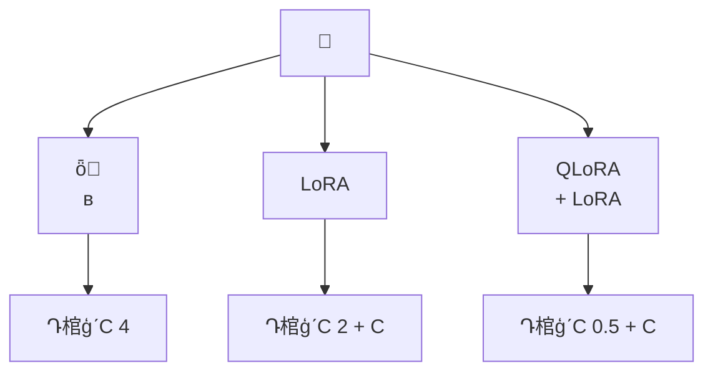

---
title: ģ΢ݼ׼
description: ݼ LoRA/QLoRA ΢ٵЧϵͳմģ΢ȫ
date: 2024-07-12T18:09:09+08:00
lastmod: 2024-07-12T18:09:09+08:00
weight: 6
tags:
  - 
  - ģ΢
  - LoRA
  - ݼ
categories:
  - 
  - 
math: true
mermaid: true
photos:
  - https://images.unsplash.com/photo-1516414746402-935ce3621729?w=1920&q=80
---

## Գ

> **Թ**ǹ˾Ҫһֱ֣ͨôģЧ롣ѡ΢ RAG΢ݼô׼ʲô
>
> **ѡ**Ҫ"ģͲ֪"֪ʶȱʧ RAG"ģͲᰴĸʽͿ"/⣬΢ܶೡҪ߽ϡ
>
> **Թ**ȷҪ΢ݼô10 ݹ
>
> **ѡ**10 ݶ LoRA ΢ǹġؼͶԡһ Alpaca ʽָݼϴע֤

һ **ģ΢ȫ** ĸƵ⣬˴жϡ׼ѡЧ·Ľϵͳ𰸡

## ʲôʱҪ΢

### ΢ vs Prompt Engineering vs RAG

ܶһЧ뵽΢΢һȷѡַó

```mermaid
graph TD
    A[ģЧ] --> B{}
    B -->|֪ʶȱʧ| C[RAG ǿ]
    B -->|ʽ/񲻶| D[Prompt Engineering]
    B -->|| E[΢ Fine-tuning]
    B -->|϶| F[RAG + ΢ ]
    C --> C1["ص㣺֪ʶɸ£ѵ"]
    D --> D1["ص㣺ɱ"]
    E --> E1["ص㣺䣬Ч־"]
    F --> F1["ص㣺Чɱ"]
```

ߵĺ

| ά | Prompt Engineering | RAG | ΢ |
|------|-------------------|-----|------|
| **** |  | ⲿ֪ʶ | ıģ |
| **ѵɱ** |  | 㣨蹹 | и |
| **ٶ** | 뼶 | Ӽ | Сʱ~켶 |
| **֪ʶ** | ޸ Prompt  | ֪ʶ⼴ | ѵ |
| **ó** |  | Ҫ׼ȷʵ | 䡢ͳһ |

### ΢ĺź

۲쵽ʱ΢ȷѡ

1. **Prompt ѾܳƣģȻ**߽
2. **Ҫһµʽ/**Prompt ȶ
3. **ضģʽ**ͨģƫ
4. **Ҫɱ**΢СģͿԴﵽģ+Prompt Ч
5. **ӳ**޷ Prompt ʾ

## ݼ׼

### ָݸʽ

ָ΢Instruction TuningĿǰ΢ʽǽ֯Ϊ"ָ--"Ԫ顣

#### Alpaca ʽ

```json
{
  "instruction": "·Ϊͨ׶",
  "input": "һкͬкͬ񲻷ԼģӦеСȡȴʩ⳥ʧΥԼΡ",
  "output": "ǩ˺ͬһûͬԼ飬òãҪеΣҪô꣬Ҫô취ֲҪôǮ"
}
```

#### ShareGPT ʽֶԻ

```json
{
  "conversations": [
    {"from": "human", "value": "ݺͬЩ"},
    {"from": "gpt", "value": "ע⵽3ڵԼȨ޸Ϊ..."},
    {"from": "human", "value": "ΥԼأ"},
    {"from": "gpt", "value": "ΥԼΪͬܶ30%..."}
  ]
}
```

ָʽóԱȣ

| ʽ | ݽṹ | ó | תѶ |
|------|---------|---------|---------|
| **Alpaca** | ָ | ͡ࡢ |  |
| **ShareGPT** | ֶԻ | Ի͡ | е |

### ϴ

```mermaid
graph LR
    A[ԭʼ] --> B[ȥ]
    B --> C[ʽУ]
    C --> D[]
    D --> E[Ϣ]
    E --> D2[ȹ]
    D2 --> F[˹]
    F --> G[ѵ]
    F --> H[֤]
    F --> I[Լ]
```

```python
import json
import re
from collections import Counter

class DatasetCleaner:
    """ݼϴ"""

    def __init__(self):
        self.stats = {
            "total": 0, "after_dedup": 0, "after_quality": 0,
            "after_length": 0,
        }

    def clean(self, data: list[dict]) -> list[dict]:
        """ϴ"""
        self.stats["total"] = len(data)

        # 1. ȥأָ+Ĺϣ
        data = self._deduplicate(data)
        self.stats["after_dedup"] = len(data)

        # 2. ʽУ
        data = self._validate_format(data)

        # 3. 
        data = self._filter_quality(data)
        self.stats["after_quality"] = len(data)

        # 4. ȹ
        data = self._filter_length(data, min_len=10, max_len=4096)
        self.stats["after_length"] = len(data)

        self._print_stats()
        return data

    def _deduplicate(self, data: list[dict]) -> list[dict]:
        """ݹϣȥ"""
        seen = set()
        result = []
        for item in data:
            key = hash(item.get("instruction", "") + item.get("input", ""))
            if key not in seen:
                seen.add(key)
                result.append(item)
        return result

    def _validate_format(self, data: list[dict]) -> list[dict]:
        """Уֶ"""
        return [
            item for item in data
            if item.get("instruction") and item.get("output")
        ]

    def _filter_quality(self, data: list[dict]) -> list[dict]:
        """ˣ˹ظ"""
        result = []
        for item in data:
            output = item.get("output", "")
            # ̣ռλ
            if len(output.strip()) < 5:
                continue
            # ȫظַ
            if len(set(output)) < 5:
                continue
            result.append(item)
        return result

    def _filter_length(
        self, data: list[dict], min_len: int, max_len: int,
    ) -> list[dict]:
        """ȹ"""
        result = []
        for item in data:
            total_len = len(item.get("instruction", "")) + \
                        len(item.get("input", "")) + \
                        len(item.get("output", ""))
            if min_len <= total_len <= max_len:
                result.append(item)
        return result

    def _print_stats(self):
        print(f"ϴͳ:")
        for key, val in self.stats.items():
            print(f"  {key}: {val}")
```

### Ȩ

׷ʵĵ㡣ݣ

|  | ó | ԤЧ |
|--------|---------|---------|
| 100 - 500  | ʽͳһ | ʽһ |
| 500 - 5,0  | ضŻ |  |
| 5,0 - 50,0  | ע | ֪ʶǿ |
| 50,0+  | ͨչ | ӽȫ΢Ч |

> **ԭ**Զ10 ϸѡݣЧ 50 ݡ

嵥

- [ ] ָȷ
- [ ] ׼ȷ޴
- [ ] ʽͳһ淶
- [ ] ָ㹻߶ƣ
- [ ] Ѷȷֲ/е/ѣ
- [ ] ȥϢ绰֤ȣ

## ΢Ա

### ȫ΢ vs LoRA vs QLoRA



LoRA ĺѧԭõȾȨظ£

$$
W = W_0 + \Delta W = W_0 + BA
$$

 $W_0$ ᣬֻѵ $B \in \mathbb{R}^{d \times r}$  $A \in \mathbb{R}^{r \times k}$$r \ll \min(d, k)$ ǵάȡѵɺ$BA$ Ժϲ $W_0$ У**޶⿪**

ַϸԱȣ

| ά | ȫ΢ | LoRA | QLoRA |
|------|---------|------|-------|
| **ѵ** | 100% | 0.1% - 1% | 0.1% - 1% |
| **Դ7B ģͣ** | ~80GB | ~16GB | ~6GB |
| **ѵٶ** |  |  |  |
| **Ч** |  | ӽȫ | Ե LoRA |
| **** |  | ޣɺϲ | ޣɺϲ |
| **л** | ģ | ֻл | ֻл |
| ** GPU** | A100/H100 Ⱥ |  24GB GPU | Ѽ GPU RTX 4090 |

### LoRA ؼ

|  |  | Ƽֵ | Ӱ |
|------|------|--------|------|
| `r`ȣ | ά | 8, 16, 64 | ԽЧԽãԽ |
| `lora_alpha` |  | ͨΪ `r`  2  | Ӱǿ |
| `lora_dropout` | Dropout  | 0.05 - 0.1 | ֹ |
| `target_modules` | Ӧ LoRA IJ | q_proj, v_proj ȫ |   Ч |

## ʾʹ PEFT  LoRA ΢

### ʹ Hugging Face PEFT 

```python
import torch
from datasets import Dataset
from peft import LoraConfig, get_peft_model, TaskType
from transformers import (
    AutoModelForCausalLM,
    AutoTokenizer,
    TrainingArguments,
    Trainer,
    DataCollatorForSeq2Seq,
)

# ========== 1. Ԥѵģִ ==========
model_path = "Qwen/Qwen2.5-7B-Instruct"
tokenizer = AutoTokenizer.from_pretrained(model_path, trust_remote_code=True)
model = AutoModelForCausalLM.from_pretrained(
    model_path,
    torch_dtype=torch.bfloat16,
    device_map="auto",
    trust_remote_code=True,
)

# ========== 2.  LoRA ==========
lora_config = LoraConfig(
    task_type=TaskType.CAUSAL_LM,
    r=16,                    # ά
    lora_alpha=32,           #  = r  2 
    lora_dropout=0.05,       # Dropout
    target_modules=[         # ЩӦ LoRA
        "q_proj", "k_proj", "v_proj", "o_proj",
        "gate_proj", "up_proj", "down_proj",
    ],
    bias="none",
)

model = get_peft_model(model, lora_config)
model.print_trainable_parameters()
# ʾtrainable params: 19,594,240 || all params: 7,621,877,760 || trainable%: 0.2571%

# ========== 3. Ԥ ==========
def format_alpaca(example: dict) -> str:
    """ Alpaca ʽתΪģ"""
    if example.get("input"):
        prompt = (
            f"Below is an instruction that describes a task, "
            f"paired with an input that provides further context. "
            f"Write a response that appropriately completes the request.\n\n"
            f"### Instruction:\n{example['instruction']}\n\n"
            f"### Input:\n{example['input']}\n\n"
            f"### Response:\n{example['output']}"
        )
    else:
        prompt = (
            f"Below is an instruction that describes a task. "
            f"Write a response that appropriately completes the request.\n\n"
            f"### Instruction:\n{example['instruction']}\n\n"
            f"### Response:\n{example['output']}"
        )
    return prompt

def tokenize_function(examples, max_length=2048):
    """ִʣǩ"""
    formatted = [format_alpaca(ex) for ex in examples]
    result = tokenizer(
        formatted,
        truncation=True,
        max_length=max_length,
        padding=False,
    )
    # Իعѵǩ = input_ids
    result["labels"] = result["input_ids"].copy()
    return result

# ݼ
raw_dataset = Dataset.from_json("legal_data.json")
tokenized_dataset = raw_dataset.map(
    tokenize_function,
    batched=True,
    remove_columns=raw_dataset.column_names,
)

# ѵ/֤
split = tokenized_dataset.train_test_split(test_size=0.1, seed=42)
train_dataset = split["train"]
eval_dataset = split["test"]

# ========== 4. ѵ ==========
training_args = TrainingArguments(
    output_dir="./lora_output",
    num_train_epochs=3,
    per_device_train_batch_size=4,
    per_device_eval_batch_size=4,
    gradient_accumulation_steps=4,    # ݶۻģ batch_size=16
    learning_rate=2e-4,               # LoRA ѧϰʱȫ΢
    warmup_ratio=0.1,                 # Warmup
    lr_scheduler_type="cosine",       # ˻
    logging_steps=10,
    eval_strategy="steps",
    eval_steps=100,
    save_strategy="steps",
    save_steps=100,
    save_total_limit=3,
    load_best_model_at_end=True,
    metric_for_best_model="eval_loss",
    greater_is_better=False,
    bf16=True,                        # Ͼ
    gradient_checkpointing=True,      # ݶȼ㣬ʡԴ
    report_to="tensorboard",
)

# ========== 5. ʼѵ ==========
data_collator = DataCollatorForSeq2Seq(
    tokenizer=tokenizer,
    padding=True,
    return_tensors="pt",
)

trainer = Trainer(
    model=model,
    args=training_args,
    train_dataset=train_dataset,
    eval_dataset=eval_dataset,
    data_collator=data_collator,
)

trainer.train()

# ========== 6.  ==========
model.save_pretrained("./lora_legal")
tokenizer.save_pretrained("./lora_legal")
print("LoRA ѱ棬ռüʮ MB")
```

### ʹ LLaMA-Factory΢

LLaMA-Factory ṩ YAML ΢ʽʺϲдij

```yaml
# legal_lora.yaml
### ģ
model_name_or_path: Qwen/Qwen2.5-7B-Instruct
trust_remote_code: true

### ΢
stage: sft
do_train: true
finetuning_type: lora
lora_rank: 16
lora_alpha: 32
lora_target: all

### ݼ
dataset: legal_alpaca
template: qwen
cutoff_len: 2048
max_samples: 10

### ѵ
output_dir: ./lora_legal
num_train_epochs: 3
per_device_train_batch_size: 4
gradient_accumulation_steps: 4
learning_rate: 2.0e-4
warmup_ratio: 0.1
lr_scheduler_type: cosine
logging_steps: 10
save_steps: 100
plot_loss: true

### ԴŻ
bf16: true
gradient_checkpointing: true
```

```bash
# ѵ
llamafactory-cli train legal_lora.yaml

# ϲģ
llamafactory-cli export \
    --model_name_or_path Qwen/Qwen2.5-7B-Instruct \
    --adapter_name_or_path ./lora_legal \
    --export_dir ./merged_legal \
    --export_size 4
```

## Ч

### ϵ

```mermaid
graph TD
    A[΢Ч] --> B[Զ]
    A --> C[˹]
    A --> D[Ա]
    B --> B1[ Perplexity]
    B --> B2[BLEU / ROUGE]
    B --> B3[׼ȷ / F1]
    C --> C1[]
    C --> C2[ʵ׼ȷ]
    C --> C3[ʽϹ]
    D --> D1[΢ǰ vs ΢]
    D --> D2[LoRA vs ȫ΢]
```

### Աʵ

```python
from openai import OpenAI

client = OpenAI()

def pairwise_compare(
    prompt: str,
    response_a: str,
    response_b: str,
    criteria: str = "׼ȷԡרҵԺ͸ʽ淶",
) -> dict:
    """ʹ GPT-4 ΪУԱظ"""
    judge_prompt = f"""һרҵ±׼ظ{criteria}

⣺{prompt}

ظ A{response_a}
ظ B{response_b}


1. ظ A ֣1-10
2. ظ B ֣1-10
3. ĸãA/B/ƽ֣
4. 

 JSON ʽ"""

    resp = client.chat.completions.create(
        model="gpt-4o",
        messages=[{"role": "user", "content": judge_prompt}],
        response_format={"type": "json_object"},
    )
    return resp.choices[0].message.content

# ΢ǰЧ
test_cases = [
    {"prompt": "ݺͬΥԼ", "criteria": "רҵԺͷʶ"},
    {"prompt": "һݱЭ", "criteria": "ʽ淶Ժͷ"},
]

results = []
for case in test_cases:
    # ΢ǰ
    base_response = call_base_model(case["prompt"])
    # ΢
    tuned_response = call_tuned_model(case["prompt"])
    # Ա
    comparison = pairwise_compare(
        case["prompt"],
        base_response,
        tuned_response,
        case["criteria"],
    )
    results.append(comparison)
```

## ׷

### Q1΢ô죿

**Թ׷**ѵ 10  epoch ֤ loss ʼˣô죿

**شҪ**

- **ǰֹͣEarly Stopping**֤ lossڿʼʱֹͣ
- ** Dropout**`lora_dropout`  0.05 ᵽ 0.1
- ** epoch**ָ΢ͨ 3-5  epoch 㹻
- **ݶ**ݲ
- **С LoRA ** `r` ֵģ
- **ѧϰ˥**ʹ˻

```python
# ǰֹͣж߼
if eval_loss < best_eval_loss:
    best_eval_loss = eval_loss
    patience_counter = 0
    save_best_model()
else:
    patience_counter += 1
    if patience_counter >= patience:  # Ĭ patience=3
        print("ǰֹͣ")
        break
```

### Q2ѡ񳬲

**شҪ**

|  | ѡ | ƼΧ |
|--------|---------|---------|
| ѧϰ |  1e-4 ʼ 3  | 1e-5 ~ 5e-4 |
| LoRA  r |  8 ʵ飬ٵ 16/64 | 4, 8, 16, 32, 64 |
| batch size | ݶۻ | 4-32Ч |
| epoch | ֤ lossͨ 3-5 | 2-10 |
| target_modules |  q_proj+v_projЧټȫ | - |

### Q3λ⣿

**Թ׷**΢ģڷֺܺãѧⶼˣô

**شҪ**

Catastrophic Forgettingָģѧϰ֪ʶ˾֪ʶԣ

```mermaid
graph TD
    A[] --> B[ѵ]
    A --> C[ѧϰ]
    A --> D[ѵִ]
    A --> E[LoRA Ȼ]
    B --> B1[" + ͨ <br/> 7:3  8:2"]
    C --> C1["øСѧϰ<br/>ٶԭȨصĸ"]
    D --> D1["2-3  epoch 㹻<br/>Ҫѵ"]
    E --> E1["LoRA ԭʼȨ<br/>֪ʶ"]
```

|  | ԭ | Ч |
|------|------|------|
| **ݻ** | ѵмͨ | Ч |
| **ѧϰ** | СԤѵȨصĸ | Ч |
| ** epoch** |  | Ч |
| **LoRA** | ԭʼȨأֻѵ | Ȼ⣬Ƽ |
| **** | KL ɢԼֲ | Чõʵָ |

### Q4΢ RAG ôϣ

**شҪ**

- **΢ı"ôش"**񡢸ʽʽ
- **RAG ṩ"شʲô"**׼ȷ֪ʶʵ
- ߻΢ģ͸óRAG ṩµķ

```mermaid
graph LR
    A[û] --> B[]
    B --> C[װ Prompt]
    C --> D[΢ģ]
    D --> E["רҵ׼ȷĻش"]
```

## 

ģ΢ͨôģҵ񳡾΢ȫ̵ĹؼҪ㣺

1. **жǷҪ΢**֪ʶȱʧRAG㣨΢
2. ** > **10 ѡʤ 50 
3. **ѡ񿴳**LoRA Լ۱֮QLoRA ʺѼ GPU
4. **Ҫȫ**Զָ + ˹ + ΢ǰԱ
5. **Ϻ**ǰֹͣ + ݻ

סʱĥݣڼϿϸڴ档

## ο

1. Hu E J, et al. LoRA: Low-Rank Adaptation of Large Language Models. ICLR 2022.
2. Dettmers T, et al. QLoRA: Efficient Finetuning of Quantized LLMs. NeurIPS 2023.
3. Taori R, et al. Stanford Alpaca. 2023.
4. LLaMA-Factory. https://github.com/hiyouga/LLaMA-Factory
5. Hugging Face PEFT. https://github.com/huggingface/peft
